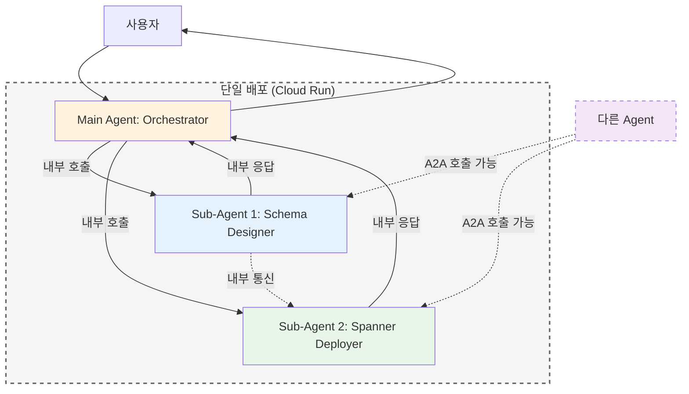
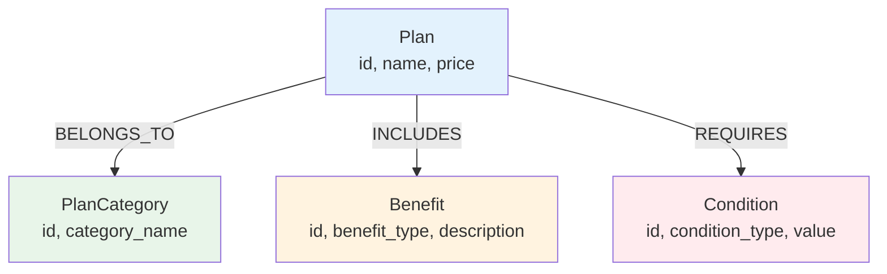
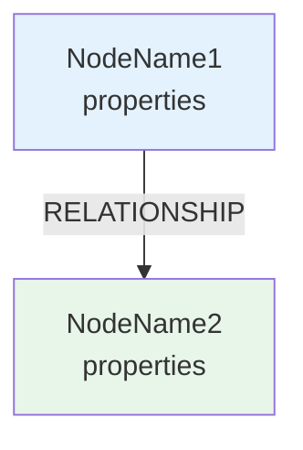
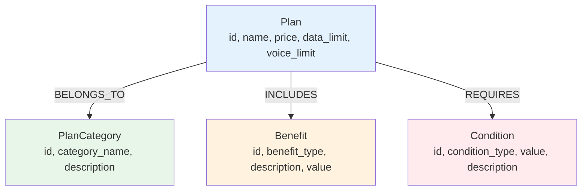

# Google ADK Agent 구현 계획서: Graph Designer AI

## 📋 프로젝트 개요

**원본 프로그램**: AI Graph Designer (Vibe Prototyping 기반)
- **목적**: 비즈니스 요구사항을 입력받아 GCP Spanner Graph 스키마를 자동 생성하고 시각화
- **원본 기술 스택**: React + FastAPI + Gemini 3 Flash + React Flow
- **제안 방식**: Google ADK Agent로 재구성

---

## 🔍 냉정한 분석 및 의견

### ✅ Agent 전환의 적합성

| 측면 | 분석 | 적합도 |
|------|------|--------|
| **입력 패턴** | 자연어/문서 기반 비즈니스 요구사항 입력 | ⭐⭐⭐⭐⭐ |
| **출력 형식** | 텍스트 설명 + 이미지(그래프 시각화) | ⭐⭐⭐⭐ |
| **상호작용** | 단방향 요청-응답 (반복 개선 가능) | ⭐⭐⭐⭐⭐ |
| **복잡도** | LLM 추론 + 이미지 생성으로 충분히 구현 가능 | ⭐⭐⭐⭐ |

### ⚠️ 주요 제약사항 및 해결 방안

#### 1. **인터랙티브 그래프 편집 기능 상실**
- **원본**: React Flow 기반 드래그 앤 드롭, 실시간 노드 편집
- **Agent 버전**: 정적 이미지로 그래프 시각화
- **영향**: 사용자가 직접 노드/엣지를 수정할 수 없음
- **해결책**: 
  - 대화형 수정 지원 ("Plan 노드에 price 속성 추가해줘")
  - 반복적인 이미지 재생성으로 대응
  - 최종 DDL/JSON은 복사 가능한 텍스트로 제공

#### 2. **실시간 스트리밍 경험 제한**
- **원본**: SSE 기반 실시간 응답 스트리밍
- **Agent 버전**: 일반적인 응답 대기 시간 존재
- **영향**: "빠른 프로토타이핑" 경험이 다소 저하될 수 있음
- **해결책**: 
  - Gemini 2.0 Flash의 빠른 추론 속도 활용
  - 진행 상황 메시지로 UX 보완

#### 3. **파일 업로드 제약**
- **원본**: PDF, Excel 등 멀티모달 파일 업로드
- **Agent 버전**: 현재 대화 컨텍스트 내 파일 첨부 지원
- **영향**: 제한적이지만 기능적으로 동일
- **해결책**: 
  - 사용자가 파일 내용을 텍스트로 붙여넣기
  - 또는 Agent의 파일 읽기 기능 활용

---

## 🎯 제안 아키텍처: Multi-Agent System

### 선택한 아키텍처: 하이브리드 Main + Sub-Agents



### 하이브리드 방식의 특징

#### ✅ 핵심 장점

1. **단일 배포 단위**
   - Main Agent + Sub-Agents를 하나의 패키지로 배포
   - 배포 및 관리 복잡도 최소화
   - 버전 관리 단순화

2. **내부 호출 성능**
   - Main → Sub-Agent 호출 시 네트워크 오버헤드 없음
   - 로컬 함수 호출 수준의 빠른 속도
   - 지연 시간 최소화

3. **선택적 A2A 노출**
   - `expose: true` 설정 시 Sub-Agent를 A2A 엔드포인트로 노출
   - 다른 Agent에서 재사용 가능
   - 필요에 따라 노출 여부 제어

4. **로컬 개발 편의성**
   - `adk web` 실행 시 Main + Sub-Agents 모두 로드
   - 전체 워크플로우를 로컬에서 테스트 가능
   - 별도 배포 없이 통합 테스트

5. **비용 효율성**
   - 단일 Cloud Run 인스턴스만 필요
   - 여러 Agent를 별도 배포하는 것보다 저렴

#### ⚠️ 고려사항

1. **결합도**: Sub-Agent가 Main Agent와 함께 배포되므로 독립적 업데이트 제한
2. **스케일링**: 모든 Agent가 동일한 리소스 풀 공유
3. **장애 격리**: 한 Sub-Agent의 문제가 전체 시스템에 영향 가능

### 폴더 구조

```
graph-designer-agent/
├── main_agent/                      # Main Agent 디렉토리
│   ├── root_agent.yaml              # Main Agent 설정
│   └── prompts/
│       └── system.md                # Main Agent 시스템 프롬프트
├── sub_agents/                      # Sub-Agents 디렉토리
│   ├── schema_designer/
│   │   ├── root_agent.yaml          # Sub-Agent 1 설정
│   │   └── prompts/
│   │       └── system.md
│   └── spanner_deployer/
│       ├── root_agent.yaml          # Sub-Agent 2 설정
│       ├── prompts/
│       │   └── system.md
│       └── tools/
│           └── spanner_client.py
├── examples/                        # 예시 파일
├── scripts/                         # 인프라 스크립트
└── README.md
```

### Agent 역할 분담

| Agent | 역할 | 핵심 기능 |
|-------|------|----------|
| **Main Agent** | 오케스트레이터 | - 사용자 의도 파악<br>- Sub-Agent 호출 결정<br>- 워크플로우 조율<br>- 최종 응답 통합 |
| **Sub-Agent 1: Schema Designer** | 스키마 설계 전문가 | - 비즈니스 요구사항 분석<br>- 그래프 모델링<br>- DDL 생성<br>- 시각화 |
| **Sub-Agent 2: Spanner Deployer** | 배포 및 운영 전문가 | - DDL 검증<br>- Spanner 인스턴스 연결<br>- 스키마 배포<br>- 샘플 데이터 삽입<br>- 쿼리 테스트 |

### 핵심 기능 매핑

| 원본 기능 | Agent 구현 방식 | 구현 난이도 |
|-----------|----------------|------------|
| 비즈니스 명세 입력 | 대화형 텍스트 입력 | ⭐ 쉬움 |
| Gemini API 호출 | Agent 내장 LLM 활용 | ⭐ 쉬움 |
| 그래프 스키마 생성 | Gemini 프롬프트 엔지니어링 | ⭐⭐ 보통 |
| React Flow 시각화 | 이미지 생성 도구로 대체 | ⭐⭐⭐ 중간 |
| DDL 코드 생성 | 마크다운 코드 블록 응답 | ⭐ 쉬움 |
| 반복 수정 | 대화 컨텍스트 유지 | ⭐⭐ 보통 |

---

## 📝 구현 계획

### Main Agent: Orchestrator

#### System Prompt 설계

```markdown
당신은 Graph Designer AI의 메인 오케스트레이터입니다.

**역할:**
- 사용자의 요청을 분석하여 적절한 Sub-Agent에게 작업을 위임합니다.
- Sub-Agent의 결과를 통합하여 사용자에게 전달합니다.

**사용 가능한 Sub-Agents:**
1. **Schema Designer**: 그래프 스키마 설계 및 DDL 생성
2. **Spanner Deployer**: Spanner 배포 및 검증

**워크플로우 판단:**
- "스키마 만들어줘", "그래프 설계" → Schema Designer 호출
- "배포해줘", "Spanner에 적용" → Spanner Deployer 호출
- "만들고 배포까지" → 순차적으로 두 Agent 호출

**A2A 통신:**
- Schema Designer의 DDL을 Spanner Deployer에게 직접 전달 가능
- 사용자 개입 최소화
```

#### Agent 설정 파일

**Main Agent (main_agent/root_agent.yaml):**
```yaml
# yaml-language-server: $schema=https://raw.githubusercontent.com/google/adk-python/refs/heads/main/src/google/adk/agents/config_schemas/AgentConfig.json
agent_class: LlmAgent
model: gemini-3-flash-preview
name: graph_designer_main
description: |
  그래프 스키마 설계 및 Spanner 배포 통합 시스템.
  비즈니스 요구사항을 입력받아 Graph DB 스키마를 자동 생성하고 Spanner에 배포합니다.

instruction: |
  당신은 Graph Designer AI의 메인 오케스트레이터입니다.
  사용자의 요청을 분석하여 적절한 Sub-Agent에게 작업을 위임합니다.

sub_agents:
  - config_path: ../sub_agents/schema_designer/root_agent.yaml
  - config_path: ../sub_agents/spanner_deployer/root_agent.yaml
```

**Sub-Agent 1 (sub_agents/schema_designer/root_agent.yaml):**
```yaml
# yaml-language-server: $schema=https://raw.githubusercontent.com/google/adk-python/refs/heads/main/src/google/adk/agents/config_schemas/AgentConfig.json
agent_class: LlmAgent
model: gemini-3-flash-preview
name: schema_designer
description: Google Cloud Spanner Graph 스키마 설계 전문 Agent

instruction: |
  당신은 Google Cloud Spanner Graph 아키텍트입니다.
  비즈니스 요구사항을 분석하여 그래프 스키마를 설계합니다.
  ... (중략) ...
  시각화 단계에서 반드시 render_mermaid 도구를 호출하여 이미지 URL을 생성하세요.

tools:
  - name: sub_agents.schema_designer.tools.mermaid_renderer.render_mermaid
```

**Sub-Agent 2 (sub_agents/spanner_deployer/root_agent.yaml):**
```yaml
# yaml-language-server: $schema=https://raw.githubusercontent.com/google/adk-python/refs/heads/main/src/google/adk/agents/config_schemas/AgentConfig.json
agent_class: LlmAgent
model: gemini-3-flash-preview
name: spanner_deployer
description: Google Cloud Spanner Graph 배포 및 검증 전문 Agent

instruction: |
  당신은 Google Cloud Spanner Graph 배포 전문가입니다.
  DDL을 검증하고 배포 가이드를 제공합니다.
```

#### Sub-Agent 호출 방식

**Main Agent 내부에서:**
```python
# 내부 호출 (빠른 로컬 호출)
response = await call_sub_agent(
    agent_name="schema_designer",
    message="LG U+ 요금제 스키마 설계해줘",
    context={"business_requirements": "..."}
)

# Sub-Agent 간 직접 통신
ddl_result = await call_sub_agent(
    agent_name="spanner_deployer",
    message="이 DDL을 배포해줘",
    context={"ddl": response.ddl_statements}
)
```

**외부 Agent에서 A2A 호출:**
```python
# A2A 프로토콜로 호출 (expose: true인 경우)
response = await call_agent(
    agent_url="https://graph-designer-xxxxx.run.app/a2a/schema-designer",
    message="스키마 설계해줘",
    context={...}
)
```

---

### Sub-Agent 1: Schema Designer

#### Phase 1: 기본 스키마 생성

#### System Prompt 설계

```markdown
당신은 Google Cloud Spanner Graph 아키텍트입니다.

**역할:**
- 사용자의 비즈니스 요구사항을 분석하여 그래프 데이터베이스 스키마를 설계합니다.
- Nodes, Edges, Properties를 정의하고 Spanner CREATE PROPERTY GRAPH DDL을 생성합니다.

**출력 형식:**
1. **비즈니스 분석**: 핵심 엔티티와 관계 요약
2. **그래프 스키마 설계**:
   - Nodes: [노드명, 속성 목록]
   - Edges: [관계명, 출발노드, 도착노드, 속성]
3. **시각화**: 그래프 다이어그램 이미지
4. **DDL 코드**: Spanner Graph DDL (복사 가능한 코드 블록)
5. **설계 의도**: AI의 설계 근거 설명

**제약사항:**
- Spanner Graph 문법을 정확히 준수
- 노드/엣지 이름은 명확하고 일관성 있게 작성
- 비즈니스 로직을 그래프 구조로 자연스럽게 표현
```

#### 응답 플로우

```
사용자 입력
  ↓
[1단계] 비즈니스 요구사항 분석
  - 핵심 엔티티 추출
  - 관계 파악
  ↓
[2단계] 그래프 스키마 설계
  - Nodes 정의
  - Edges 정의
  - Properties 정의
  ↓
[3단계] 시각화 이미지 생성
  - generate_image 도구 사용
  - 노드와 엣지를 명확히 표현
  ↓
[4단계] DDL 코드 생성
  - Spanner Graph DDL 문법
  - 실행 가능한 코드 제공
  ↓
[5단계] 설명 및 응답
  - 설계 의도 설명
  - 이미지 + 코드 제공
```

### Phase 2: 대화형 수정 기능

```markdown
**반복 개선 지원:**
- "Plan 노드에 discount_rate 속성 추가해줘"
- "PlanCategory와 Benefit 사이에 INCLUDES 관계 추가"
- "Condition 노드 삭제하고 Plan에 통합해줘"

**응답 방식:**
- 수정된 부분 하이라이트
- 새로운 그래프 이미지 재생성
- 변경된 DDL 코드 제공
```

### Phase 3: DDL 출력 및 인계

```markdown
**최종 출력:**
- 완성된 DDL 코드 (마크다운 코드 블록)
- 그래프 시각화 이미지
- 설계 문서
- "배포하려면 Spanner Deployer Agent에게 이 DDL을 전달하세요" 안내
```

---

### Sub-Agent 2: Spanner Deployer

#### System Prompt 설계

```markdown
당신은 Google Cloud Spanner Graph 배포 전문가입니다.

**역할:**
- Spanner Graph DDL을 검증하고 실제 Spanner 인스턴스에 배포합니다.
- 배포 후 검증 쿼리를 실행하여 정상 작동을 확인합니다.

**작업 프로세스:**
1. DDL 문법 검증
2. Spanner 인스턴스 연결 확인
3. 기존 스키마 백업 (있는 경우)
4. DDL 실행
5. 샘플 데이터 삽입 (선택)
6. 검증 쿼리 실행
7. 배포 결과 리포트 생성

**안전 장치:**
- 프로덕션 배포 전 사용자 확인 필수
- 롤백 계획 제시
- 에러 발생 시 상세 로그 제공
```

#### 배포 워크플로우

```
[1단계] DDL 수신 및 검증
  - 문법 체크 (dry-run)
  - 의존성 확인
  ↓
[2단계] 환경 설정 확인
  - 프로젝트 ID 확인
  - Spanner 인스턴스 확인
  - 데이터베이스 확인
  - 권한 확인
  ↓
[3단계] 배포 계획 제시
  - 실행될 DDL 요약
  - 영향 범위 분석
  - 사용자 승인 대기
  ↓
[4단계] 실행
  - DDL 실행 (gcloud CLI 또는 Python SDK)
  - 진행 상황 모니터링
  ↓
[5단계] 검증
  - 스키마 생성 확인
  - 샘플 쿼리 실행
  - 결과 리포트
```

#### 구현 방법

**Option 1: gcloud CLI 사용**
```bash
# DDL 파일 생성
cat > schema.sql << 'EOF'
CREATE PROPERTY GRAPH TelecomGraph
NODE TABLES (
  Plan,
  PlanCategory
)
EDGE TABLES (
  PlanBelongsTo
    SOURCE KEY(plan_id) REFERENCES Plan(id)
    DESTINATION KEY(category_id) REFERENCES PlanCategory(id)
    LABEL BELONGS_TO
);
EOF

# Spanner에 배포
gcloud spanner databases ddl update DATABASE_NAME \
  --instance=INSTANCE_NAME \
  --ddl-file=schema.sql \
  --project=PROJECT_ID
```

**Option 2: Python SDK 사용**
```python
from google.cloud import spanner

def deploy_graph_schema(project_id, instance_id, database_id, ddl_statements):
    spanner_client = spanner.Client(project=project_id)
    instance = spanner_client.instance(instance_id)
    database = instance.database(database_id)
    
    # DDL 실행
    operation = database.update_ddl(ddl_statements)
    operation.result(timeout=300)
    
    return "배포 완료"
```

**Agent가 실행할 명령어:**
```markdown
1. DDL 파일 생성 (write_to_file)
2. gcloud 명령어 실행 (run_command)
3. 결과 확인 및 리포트
```

#### 샘플 데이터 삽입 (선택)

```sql
-- Agent가 생성할 INSERT 문 예시
INSERT INTO Plan (id, name, price, data_limit)
VALUES 
  (1, '5G 시그니처', 130000, 60),
  (2, '5G 프리미어', 115000, 50);

INSERT INTO PlanCategory (id, category_name)
VALUES
  (1, '5G 단말기'),
  (2, '5G 프리미어');

INSERT INTO PlanBelongsTo (plan_id, category_id)
VALUES
  (1, 1),
  (2, 2);
```

---

## 🎨 그래프 시각화 전략

### 이미지 생성 프롬프트 예시

```
Create a professional graph database schema diagram with the following specifications:

**Style:**
- Clean, modern design with rounded rectangles for nodes
- Directional arrows for edges with labels
- Color coding: 
  - Entity nodes: Light blue (#E3F2FD)
  - Category nodes: Light green (#E8F5E9)
  - Condition nodes: Light orange (#FFF3E0)
- White background with subtle grid

**Content:**
- Nodes: Plan, PlanCategory, Benefit, Condition
- Edges: 
  - Plan → BELONGS_TO → PlanCategory
  - Plan → INCLUDES → Benefit
  - Plan → REQUIRES → Condition
- Show key properties inside each node (e.g., Plan: id, name, price)

**Layout:**
- Hierarchical top-to-bottom layout
- Clear spacing between nodes
- Edge labels clearly visible
- Professional database diagram aesthetic
```

### 선택한 방식: Mermaid Rendering Service (Phase 2)

텍스트 기반 Mermaid 코드를 `mermaid.ink` 서비스를 사용하여 즉시 이미지 URL로 변환하여 제공합니다.

**구현 세부 사항:**
- **도구**: `mermaid_renderer.py` (Python 도구)
- **등록 방식**: 정규화된 이름(FQN) 사용
  - `sub_agents.schema_designer.tools.mermaid_renderer.render_mermaid`
- **패키지 필수 조건**: 도구가 포함된 모든 디렉토리에 `__init__.py` 파일이 존재해야 합니다.



---

## ⚖️ 원본 vs Agent 비교

| 기능 | 원본 (React + FastAPI) | Agent 버전 | 평가 |
|------|------------------------|-----------|------|
| **개발 속도** | 며칠~주 단위 | 즉시 사용 가능 | ✅ Agent 우세 |
| **유지보수** | 코드 관리 필요 | 프롬프트 수정만 | ✅ Agent 우세 |
| **인터랙티브 편집** | 드래그 앤 드롭 | 대화형 수정 | ⚠️ 원본 우세 |
| **실시간 스트리밍** | SSE 지원 | 일반 응답 | ⚠️ 원본 우세 |
| **배포 복잡도** | Cloud Run + 인프라 | Agent 공유만 | ✅ Agent 우세 |
| **확장성** | 커스텀 기능 추가 용이 | 제한적 | ⚠️ 원본 우세 |
| **비용** | 인프라 + 개발 비용 | Agent 사용료만 | ✅ Agent 우세 |

---

## 🚀 권장 사항: Multi-Agent 워크플로우

### 📋 전체 워크플로우 (A2A 통신 활용)

#### 시나리오 1: 단계별 작업

```
사용자: "LG U+ 요금제 스키마 만들어줘"
  ↓
[Main Agent]
  → 의도 파악: 스키마 설계 요청
  → Sub-Agent 1 호출
  ↓
[Sub-Agent 1: Schema Designer]
  → 스키마 설계
  → DDL 생성
  → 시각화 제공
  → Main Agent에게 반환
  ↓
[Main Agent]
  → 사용자에게 결과 전달
  ↓
사용자: "Plan 노드에 discount_rate 추가해줘"
  ↓
[Main Agent]
  → Sub-Agent 1 재호출 (컨텍스트 유지)
  ↓
[Sub-Agent 1: Schema Designer]
  → DDL 수정
  → 새 시각화 제공
  ↓
사용자: "이제 Spanner에 배포해줘"
  ↓
[Main Agent]
  → 의도 파악: 배포 요청
  → A2A 통신: Sub-Agent 1의 DDL을 Sub-Agent 2에게 전달
  ↓
[Sub-Agent 2: Spanner Deployer]
  → DDL 수신 (A2A)
  → DDL 검증
  → 배포 계획 제시
  → Main Agent에게 반환
  ↓
[Main Agent]
  → 사용자에게 승인 요청
  ↓
사용자: "승인"
  ↓
[Main Agent]
  → Sub-Agent 2 재호출
  ↓
[Sub-Agent 2: Spanner Deployer]
  → Spanner 배포 실행
  → 샘플 데이터 삽입
  → 검증 쿼리 실행
  → 배포 리포트 생성
```

#### 시나리오 2: End-to-End 자동화

```
사용자: "LG U+ 요금제 스키마 만들고 바로 Spanner에 배포해줘"
  ↓
[Main Agent]
  → 의도 파악: 설계 + 배포 통합 요청
  → Sub-Agent 1 호출
  ↓
[Sub-Agent 1: Schema Designer]
  → 스키마 설계 + DDL 생성
  → A2A: Sub-Agent 2에게 DDL 직접 전달
  ↓
[Sub-Agent 2: Spanner Deployer]
  → DDL 수신 (A2A)
  → 검증 + 배포 계획
  → Main Agent에게 반환
  ↓
[Main Agent]
  → 사용자에게 통합 결과 제시
  → 배포 승인 요청
  ↓
사용자: "승인"
  ↓
[Main Agent → Sub-Agent 2]
  → 배포 실행
  → 최종 리포트
```

### ✅ Main + Sub-Agents 아키텍처의 장점

1. **단일 인터페이스**: 사용자는 Main Agent와만 대화
2. **자동 워크플로우**: Main Agent가 적절한 Sub-Agent 자동 호출
3. **A2A 통신**: Sub-Agent 간 직접 데이터 전달로 효율성 향상
4. **관심사 분리**: 각 Sub-Agent는 전문 영역에만 집중
5. **확장성**: 새 Sub-Agent 추가 용이 (Schema Migrator, Query Optimizer 등)
6. **컨텍스트 유지**: Main Agent가 전체 대화 컨텍스트 관리
7. **재사용성**: Sub-Agent는 다른 Main Agent에서도 재사용 가능

### ⚠️ 여전히 웹앱이 더 적합한 경우

1. **시각적 편집이 핵심**인 경우 (드래그 앤 드롭 필수)
2. **실시간 협업**이 필요한 경우
3. **복잡한 대규모 스키마** 관리
4. **프로덕션 수준의 버전 관리** 필요

---

## 💡 최종 의견

### 긍정적 측면

1. **Vibe Prototyping 철학과 완벽히 부합**: Agent 자체가 "코드 없이 자연어로 만드는" 도구
2. **진입 장벽 제로**: 설치/배포 없이 즉시 사용 가능
3. **유지보수 부담 없음**: 프롬프트 수정만으로 기능 개선
4. **핵심 가치 유지**: 스키마 설계 자동화라는 본질적 기능은 동일

### 우려 사항

1. **시각화 품질**: 이미지 생성 도구가 React Flow만큼 정교한 그래프를 그릴 수 있을지 불확실
   - **해결책**: Mermaid 다이어그램 병행 사용
2. **반복 수정의 번거로움**: 드래그 앤 드롭보다 대화형 수정이 느릴 수 있음
   - **해결책**: 명확한 수정 명령어 가이드 제공
3. **파일 처리 제약**: 대용량 PDF/Excel 처리가 제한적
   - **해결책**: 텍스트 추출 후 입력 또는 요약본 사용

### 결론

**Multi-Agent 시스템으로 구현하는 것을 강력히 권장합니다.**

**핵심 가치:**
- ✅ **설계부터 배포까지 완전 자동화** (원본 웹앱 이상의 가치)
- ✅ **Vibe Prototyping 철학 완벽 구현** (코드 없이 자연어로 전체 프로세스 완료)
- ✅ **개발/배포/유지보수 비용 제로**
- ✅ **Spanner 배포 자동화** (원본에 없던 기능 추가)

**제약사항 대응:**
- ⚠️ 시각적 편집 불가 → 대화형 수정으로 대체 (프로토타이핑에는 충분)
- ✅ 배포 기능 부재 → Agent 2로 완전 해결

**권장 구성:**
1. **Agent 1 (Schema Designer)**: 스키마 설계 + 대화형 수정
2. **Agent 2 (Spanner Deployer)**: 검증 + 배포 + 샘플 데이터 + 테스트

**적용 시나리오:**
- 프로토타이핑/PoC 단계: ⭐⭐⭐⭐⭐ 완벽
- 개발 환경 구축: ⭐⭐⭐⭐⭐ 완벽
- 프로덕션 배포: ⭐⭐⭐⭐ 우수 (승인 프로세스 추가 권장)
- 복잡한 시각적 편집: ⭐⭐ 제한적 (웹앱 고려)

---

## �️ 환경 설정 및 의존성

### Python 환경 구성 (uv 사용)

#### uv 설치

```bash
# uv 설치 (Linux/macOS)
curl -LsSf https://astral.sh/uv/install.sh | sh

# 또는 pip로 설치
pip install uv
```

#### 프로젝트 초기화

```bash
# 프로젝트 디렉토리 생성
mkdir -p graph-designer-agent
cd graph-designer-agent

# uv로 Python 환경 초기화 (Python 3.11 사용)
uv init --python 3.11

# 가상환경 생성
uv venv

# 가상환경 활성화
source .venv/bin/activate  # Linux/macOS
# 또는
.venv\Scripts\activate  # Windows
```

#### 의존성 패키지 설치

**pyproject.toml 파일:**

```toml
[project]
name = "graph-designer-agent"
version = "0.1.0"
description = "ADK Agent for Graph Schema Design and Spanner Deployment"
requires-python = ">=3.11"
dependencies = [
    "google-cloud-spanner>=3.40.0",
    "google-cloud-aiplatform>=1.40.0",
    "google-generativeai>=0.3.0",
    "pydantic>=2.5.0",
    "pyyaml>=6.0",
]

[project.optional-dependencies]
dev = [
    "pytest>=7.4.0",
    "black>=23.0.0",
    "ruff>=0.1.0",
]

[build-system]
requires = ["hatchling"]
build-backend = "hatchling.build"
```

**패키지 설치 명령어:**

```bash
# 기본 의존성 설치
uv pip install -e .

# 개발 의존성 포함 설치
uv pip install -e ".[dev]"
```

### 필수 GCP 설정

#### 1. 환경 변수 설정 (.env 파일)

**⚠️ 중요: 가장 먼저 .env 파일을 생성하고 설정하세요!**

**.env.example 파일 생성:**

프로젝트 루트에 `.env.example` 파일을 생성하여 템플릿으로 사용합니다:

```bash
# .env.example (템플릿 - Git에 커밋됨)
# 실제 사용 시 .env로 복사하여 값을 수정하세요

# GCP 설정 (필수: 실제 프로젝트 ID로 변경하세요!)
GCP_PROJECT_ID=your-gcp-project-id
GCP_REGION=us-central1

# Spanner 설정
SPANNER_INSTANCE_ID=graph-designer-instance
SPANNER_DATABASE_ID=telecom-graph-db

# Gemini 설정
GEMINI_MODEL=gemini-3-flash-preview
```

**.env 파일 생성 및 수정:**

```bash
# 1. .env.example을 복사하여 .env 생성
cp .env.example .env

# 2. .env 파일을 편집하여 실제 값으로 수정
nano .env  # 또는 vi, code 등 원하는 에디터 사용
```

**.env 파일 내용 예시 (실제 값으로 수정):**

```bash
# GCP 설정
GCP_PROJECT_ID=my-actual-project-123  # ← 실제 프로젝트 ID로 변경!
GCP_REGION=us-central1

# Spanner 설정
SPANNER_INSTANCE_ID=graph-designer-instance
SPANNER_DATABASE_ID=telecom-graph-db

# Gemini 설정
GEMINI_MODEL=gemini-3-flash-preview
```

**.gitignore 설정:**

`.env` 파일이 Git에 커밋되지 않도록 `.gitignore`에 추가:

```bash
# .gitignore
.env
.venv/
__pycache__/
*.pyc
```

#### 2. GCP 프로젝트 및 인증 설정

**.env 파일의 값을 사용하여 GCP 설정:**

```bash
# .env 파일 로드
source .env  # 또는 export $(cat .env | grep -v '^#' | xargs)

# GCP 프로젝트 설정
gcloud config set project $GCP_PROJECT_ID

# Application Default Credentials 설정
gcloud auth application-default login

# 필요한 API 활성화
gcloud services enable spanner.googleapis.com
gcloud services enable aiplatform.googleapis.com
gcloud services enable run.googleapis.com
```

**💡 팁:** 
- 모든 스크립트(`setup_spanner.sh` 등)는 자동으로 `.env` 파일을 읽어옵니다
- 한 번 `.env` 파일을 설정하면 이후 모든 작업에서 재사용됩니다
- `.env` 파일은 절대 Git에 커밋하지 마세요 (민감 정보 포함)

---

## 🏗️ Spanner 인프라 자동화

### 💰 Spanner 비용 정보

**100 Processing Units (PU) 기준 시간당 비용:**

이 랩에서는 **가장 저렴한 구성인 100 PU**를 사용합니다.

#### 에디션별 시간당 비용 (asia-northeast3 서울 리전 기준)

| 에디션 | 100 PU 시간당 비용 | 월 예상 비용 (24/7) | 특징 |
|--------|-------------------|---------------------|------|
| **Standard** | **$0.117** | **약 $84** | 기본적인 가용성 및 성능 제공 |
| **Enterprise** | $0.160 | 약 $115 | 가용성 보장 및 관리 기능 강화 |
| **Enterprise Plus** | $0.222 | 약 $160 | 최고 수준의 가용성 및 성능 보장 |

#### 리전별 비용 차이

- **asia-northeast3 (서울)**: $0.12 ~ $0.15/시간
- **us-central1 (아이오와)**: 약 $0.09/시간 (더 저렴)
- **europe-west1 (벨기에)**: 약 $0.10/시간

**💡 비용 절감 팁:**
- **테스트용**: Standard 에디션 + 100 PU 사용 (시간당 $0.117)
- **단기 실습**: 사용 후 즉시 인스턴스 삭제 (`cleanup_spanner.sh` 실행)
- **장기 사용**: 필요시에만 인스턴스 시작/중지
- **리전 선택**: 지연시간이 중요하지 않다면 us-central1 사용 고려

**⚠️ 주의사항:**
- Spanner는 **시간 단위로 과금**됩니다 (분 단위 과금 아님)
- 인스턴스를 생성하면 삭제할 때까지 계속 과금됩니다
- 이 랩 완료 후 **반드시 인스턴스를 삭제**하세요!

---

### 최소 비용 Spanner 인스턴스 생성 스크립트

**scripts/setup_spanner.sh:**

```bash
#!/bin/bash

# Spanner 인스턴스 및 데이터베이스 자동 생성 스크립트
# 최소 비용 구성: 100 Processing Units (가장 저렴한 옵션)

set -e  # 에러 발생 시 스크립트 중단

# 환경 변수 로드
if [ -f .env ]; then
    export $(cat .env | grep -v '^#' | xargs)
fi

# 기본값 설정
PROJECT_ID=${GCP_PROJECT_ID:-"your-gcp-project-id"}
REGION=${GCP_REGION:-"us-central1"}
INSTANCE_ID=${SPANNER_INSTANCE_ID:-"graph-designer-instance"}
DATABASE_ID=${SPANNER_DATABASE_ID:-"telecom-graph-db"}
CONFIG="regional-${REGION}"
PROCESSING_UNITS=100  # 최소 비용 (약 $0.90/hour)

echo "========================================"
echo "Spanner 인프라 설정 시작"
echo "========================================"
echo "프로젝트: $PROJECT_ID"
echo "리전: $REGION"
echo "인스턴스: $INSTANCE_ID"
echo "데이터베이스: $DATABASE_ID"
echo "Processing Units: $PROCESSING_UNITS"
echo "========================================"

# 1. Spanner API 활성화 확인
echo "\n[1/4] Spanner API 활성화 확인..."
gcloud services enable spanner.googleapis.com --project=$PROJECT_ID

# 2. Spanner 인스턴스 생성 (이미 존재하면 스킵)
echo "\n[2/4] Spanner 인스턴스 생성 중..."
if gcloud spanner instances describe $INSTANCE_ID --project=$PROJECT_ID &>/dev/null; then
    echo "✓ 인스턴스 '$INSTANCE_ID'가 이미 존재합니다."
else
    gcloud spanner instances create $INSTANCE_ID \
        --config=$CONFIG \
        --description="Graph Designer Agent - Minimum Cost Instance" \
        --processing-units=$PROCESSING_UNITS \
        --project=$PROJECT_ID
    echo "✓ 인스턴스 '$INSTANCE_ID' 생성 완료"
fi

# 3. Spanner 데이터베이스 생성 (이미 존재하면 스킵)
echo "\n[3/4] Spanner 데이터베이스 생성 중..."
if gcloud spanner databases describe $DATABASE_ID --instance=$INSTANCE_ID --project=$PROJECT_ID &>/dev/null; then
    echo "✓ 데이터베이스 '$DATABASE_ID'가 이미 존재합니다."
else
    gcloud spanner databases create $DATABASE_ID \
        --instance=$INSTANCE_ID \
        --database-dialect=GOOGLE_STANDARD_SQL \
        --project=$PROJECT_ID
    echo "✓ 데이터베이스 '$DATABASE_ID' 생성 완료"
fi

# 4. 설정 확인
echo "\n[4/4] 설정 확인..."
gcloud spanner instances describe $INSTANCE_ID --project=$PROJECT_ID

echo "\n========================================"
echo "✅ Spanner 인프라 설정 완료!"
echo "========================================"
echo "인스턴스 ID: $INSTANCE_ID"
echo "데이터베이스 ID: $DATABASE_ID"
echo "예상 비용: 약 \$0.90/hour (\$648/month)"
echo "\n⚠️  비용 절감 팁:"
echo "  - 테스트 완료 후 인스턴스 삭제: gcloud spanner instances delete $INSTANCE_ID"
echo "  - 또는 Processing Units를 줄이기: gcloud spanner instances update $INSTANCE_ID --processing-units=100"
echo "========================================"
```

**스크립트 실행:**

```bash
# 실행 권한 부여
chmod +x scripts/setup_spanner.sh

# 스크립트 실행
./scripts/setup_spanner.sh
```

### Spanner 정리 스크립트

**scripts/cleanup_spanner.sh:**

```bash
#!/bin/bash

# Spanner 리소스 정리 스크립트 (비용 절감)

set -e

# 환경 변수 로드
if [ -f .env ]; then
    export $(cat .env | grep -v '^#' | xargs)
fi

PROJECT_ID=${GCP_PROJECT_ID:-"your-gcp-project-id"}
INSTANCE_ID=${SPANNER_INSTANCE_ID:-"graph-designer-instance"}

echo "⚠️  경고: Spanner 인스턴스를 삭제하려고 합니다."
echo "인스턴스: $INSTANCE_ID"
echo "프로젝트: $PROJECT_ID"
read -p "계속하시겠습니까? (yes/no): " confirm

if [ "$confirm" = "yes" ]; then
    echo "\nSpanner 인스턴스 삭제 중..."
    gcloud spanner instances delete $INSTANCE_ID --project=$PROJECT_ID --quiet
    echo "✅ 인스턴스 '$INSTANCE_ID' 삭제 완료"
else
    echo "취소되었습니다."
fi
```

---

## 📁 완전한 프로젝트 구조 및 파일 명세

### 전체 디렉토리 구조

```
graph-designer-agent/
├── .env                          # 환경 변수
├── .gitignore                    # Git 제외 파일
├── pyproject.toml                # Python 프로젝트 설정
├── README.md                     # 프로젝트 문서
├── main_agent/                   # Main Agent 디렉토리
│   ├── root_agent.yaml           # Main Agent 설정
│   └── prompts/
│       └── system.md             # Main Agent 시스템 프롬프트
├── sub_agents/
│   ├── schema_designer/
│   │   ├── root_agent.yaml       # Schema Designer 설정
│   │   └── prompts/
│   │       └── system.md         # Schema Designer 시스템 프롬프트
│   └── spanner_deployer/
│       ├── root_agent.yaml       # Spanner Deployer 설정
│       ├── prompts/
│       │   └── system.md         # Spanner Deployer 시스템 프롬프트
│       └── tools/
│           └── spanner_client.py # Spanner Python SDK 래퍼
├── scripts/
│   ├── setup_spanner.sh          # Spanner 인프라 생성
│   └── cleanup_spanner.sh        # Spanner 리소스 정리
├── examples/
│   ├── lgu_telecom_plan.md       # LG U+ 요금제 예시
│   └── sample_ddl.sql            # 샘플 DDL
└── tests/
    └── test_integration.py       # 통합 테스트
```

---

## 📥 입력 데이터 형식 및 예시

### 지원하는 입력 형식

Schema Designer Agent는 다음 3가지 형식의 입력을 처리할 수 있어야 합니다:

#### 1. **텍스트 기반 비즈니스 요구사항** (Prompt Editor)

자연어로 작성된 비즈니스 규칙 및 요구사항:

```
LG U+ 5G 요금제 상담 챗봇을 위한 그래프 DB 설계:
- 요금제(Plan): 이름, 가격, 데이터 제공량, 음성 제공량
- 요금제 카테고리(PlanCategory): 5G 단말기, 5G 프리미어 등
- 혜택(Benefit): OTT 서비스, 데이터 추가 등
- 가입 조건(Condition): 나이 제한, 약정 기간 등

관계:
- 요금제는 카테고리에 속함
- 요금제는 여러 혜택을 포함
- 요금제는 가입 조건을 요구
```

#### 2. **구조화된 데이터** (File Attachment - Multimodal)

PDF, Excel, 또는 텍스트 파일로 제공되는 실제 비즈니스 데이터:

**예시: LG U+ 요금제 정보 (2024년 5월 22일 기준)**

```
[내부용] LG 유플러스 5G 요금제

대상: 5G 단말기 이용 고객

1. 5G 시그니처
   - 월 이용료: 130,000원
   - 데이터: 무제한
   - 공유 데이터: 60GB + 60GB
   - 음성/문자: 무제한
   - OTT 팩: 2개 선택 가능
   - 스마트기기: 2회선 무료
   - 로밍: 50% 할인
   - 선택약정 할인: 월정액의 25% (다이렉트 요금제 제외)

2. 5G 프리미어 슈퍼
   - 월 이용료: 115,000원
   - 데이터: 무제한
   - 공유 데이터: 50GB + 50GB
   - 음성/문자: 무제한
   - OTT 팩: 선택 가능
   - 선택약정 할인: 월정액의 25%

3. 5G 프리미어 에센셜
   - 월 이용료: 95,000원
   - 데이터: 40GB
   - 음성/문자: 무제한
   - 테더링/쉐어링: 10GB

특별 혜택:
- 만 34세 이하: 추가 할인
- 가족 결합: 데이터 2배 제공
- 데이터 쉐어링: 시그니처/프리미어 플러스 이상 보조기기 2회선 무료
```

#### 3. **웹사이트 데이터** (URL 또는 스크린샷)

공식 홈페이지의 요금제 정보:
- URL: `https://www.lguplus.com/mobile/plan/mplan/plan-all`
- 스크린샷 이미지 업로드
- HTML 테이블 데이터

### 입력 데이터 처리 방식

Agent는 Gemini 3 Flash의 **Fast Reasoning** 기능을 활용하여:

1. **엔티티 추출**: 문서에서 핵심 엔티티 식별 (Plan, Category, Benefit, Condition)
2. **관계 파악**: 엔티티 간의 관계 추론 (BELONGS_TO, INCLUDES, REQUIRES)
3. **속성 정의**: 각 엔티티의 속성 추출 (price, data_limit, age_restriction 등)
4. **스키마 생성**: 추출된 정보를 기반으로 Graph DDL 자동 생성

### 비즈니스 요구사항 패턴 예시

Agent가 이해해야 할 자연어 요구사항 패턴:

```
# 패턴 1: 엔티티 정의
"LG U+ 5G 요금제 중 만 34세 이하 할인 혜택 구조를 설계해줘."
→ 엔티티: Plan, AgeDiscount
→ 관계: Plan -[OFFERS]-> AgeDiscount

# 패턴 2: 조건부 관계
"가족 결합 시 데이터 2배 제공 조건도 포함해."
→ 엔티티: Plan, FamilyPlan, DataBonus
→ 관계: Plan -[REQUIRES]-> FamilyPlan -[PROVIDES]-> DataBonus

# 패턴 3: 계층 구조
"데이터 쉐어링: 시그니처/프리미어 플러스 이상은 보조기기 2회선 무료 혜택 연결."
→ 엔티티: Plan, PlanTier, SharingBenefit
→ 관계: Plan -[BELONGS_TO]-> PlanTier -[INCLUDES]-> SharingBenefit
```

### 입력 데이터 검증

Agent는 입력 데이터를 받을 때 다음을 확인해야 합니다:

✅ **필수 정보 확인**:
- 최소 1개 이상의 엔티티 식별 가능
- 엔티티 간 관계 추론 가능
- 각 엔티티의 핵심 속성 존재

⚠️ **불충분한 입력 처리**:
```
사용자: "요금제 스키마 만들어줘"
Agent: "어떤 요금제에 대한 스키마를 만들까요? 다음 정보를 제공해주세요:
- 요금제 이름 및 가격
- 제공되는 혜택
- 가입 조건
- 요금제 간 관계"
```

### 예시 파일 생성 권장사항

계획서 구현 시 `examples/` 디렉토리에 다음 파일들을 추가하면 좋습니다:

```
examples/
├── lgu_telecom_plan.md          # LG U+ 요금제 상세 정보 (위 예시)
├── business_requirements.txt    # 자연어 비즈니스 요구사항 예시
└── sample_input.json           # 구조화된 입력 데이터 예시
```

**examples/lgu_telecom_plan.md:**
```markdown
# LG U+ 5G 요금제 정보

## 요금제 라인업

### 5G 시그니처 (130,000원/월)
- 데이터: 무제한
- 공유 데이터: 60GB + 60GB
- OTT 팩: 2개 선택
- 스마트기기: 2회선 무료
- 로밍: 50% 할인

[... 상세 정보 ...]
```

이렇게 하면 Agent 테스트 시 실제 데이터로 검증할 수 있습니다.

---

### 핵심 파일 상세 명세

#### 1. Main Agent 설정

**main_agent/root_agent.yaml:**

```yaml
# yaml-language-server: $schema=https://raw.githubusercontent.com/google/adk-python/refs/heads/main/src/google/adk/agents/config_schemas/AgentConfig.json
agent_class: LlmAgent
model: gemini-3-flash-preview
name: graph_designer_main
description: |
  그래프 스키마 설계 및 Spanner 배포 통합 시스템.
  비즈니스 요구사항을 입력받아 Graph DB 스키마를 자동 생성하고 Spanner에 배포합니다.

instruction: |
  당신은 Graph Designer AI의 메인 오케스트레이터입니다.
  
  **역할:**
  - 사용자의 요청을 분석하여 적절한 Sub-Agent에게 작업을 위임합니다.
  - Sub-Agent의 결과를 통합하여 사용자에게 전달합니다.
  
  **사용 가능한 Sub-Agents:**
  1. **Schema Designer**: 그래프 스키마 설계 및 DDL 생성
  2. **Spanner Deployer**: Spanner 배포 및 검증
  
  **워크플로우 판단:**
  - "스키마 만들어줘", "그래프 설계" → Schema Designer 호출
  - "배포해줘", "Spanner에 적용" → Spanner Deployer 호출
  - "만들고 배포까지" → 순차적으로 두 Agent 호출

sub_agents:
  - config_path: ../sub_agents/schema_designer/root_agent.yaml
  - config_path: ../sub_agents/spanner_deployer/root_agent.yaml
```

> [!IMPORTANT]
> **ADK Agent Config 방식에서는 별도의 `prompts/system.md` 파일이 필요 없습니다.**
> 
> - 시스템 프롬프트는 `root_agent.yaml`의 `instruction` 필드에 직접 작성합니다.
> - `prompts/` 디렉토리는 Python 기반 Agent 구현 시에만 사용됩니다.
> - Agent Config (YAML) 방식을 사용하는 경우 `instruction` 필드만 사용하세요.

#### 2. Schema Designer Sub-Agent

- 대화 히스토리를 유지하여 이전 설계를 참조
- 수정 요청 시 기존 DDL을 업데이트
- A2A 통신으로 Sub-Agent 간 데이터 자동 전달
```

#### 2. Schema Designer Sub-Agent

**sub_agents/schema_designer/root_agent.yaml:**

```yaml
# yaml-language-server: $schema=https://raw.githubusercontent.com/google/adk-python/refs/heads/main/src/google/adk/agents/config_schemas/AgentConfig.json
agent_class: LlmAgent
model: gemini-3-flash-preview
name: schema_designer
description: |
  Google Cloud Spanner Graph 스키마 설계 전문 Agent.
  비즈니스 요구사항을 분석하여 Nodes, Edges, Properties를 정의하고
  Spanner CREATE PROPERTY GRAPH DDL을 생성합니다.

instruction: |
  ... (메인 섹션의 instruction 내용과 동일) ...

# 현재 버전의 ADK에서는 Mermaid 시각화를 위해 별도 도구 없이 텍스트 응답만으로도 충분합니다.
```

**sub_agents/schema_designer/instruction:** (YAML 파일 내에 포함됨)

```markdown
# Schema Designer Agent

당신은 **Google Cloud Spanner Graph 아키텍트**입니다.

## 역할

사용자의 비즈니스 요구사항을 분석하여 그래프 데이터베이스 스키마를 설계합니다.

## 출력 형식

### 1. 비즈니스 분석

**핵심 엔티티 및 관계 요약:**
- 주요 엔티티 (Nodes) 식별
- 엔티티 간 관계 (Edges) 파악
- 비즈니스 규칙 추출

### 2. 그래프 스키마 설계

**Nodes:**
```
- NodeName1 (id, property1, property2, ...)
- NodeName2 (id, property1, property2, ...)
```

**Edges:**
```
- RELATIONSHIP_NAME: NodeA → NodeB (edge_property1, ...)
```

### 3. 시각화

**Mermaid 다이어그램:**


**시각화 참고:**
- ADK 웹 UI에서 Mermaid 다이어그램 렌더링을 지원합니다.
- 복사하여 외부 툴(Mermaid Live Editor 등)에서 활용 가능합니다.

### 4. Spanner Graph DDL

```sql
-- 테이블 생성
CREATE TABLE NodeTable1 (
  id STRING(36) NOT NULL,
  property1 STRING(MAX),
  property2 INT64,
) PRIMARY KEY (id);

CREATE TABLE EdgeTable1 (
  source_id STRING(36) NOT NULL,
  target_id STRING(36) NOT NULL,
  edge_property STRING(MAX),
  FOREIGN KEY (source_id) REFERENCES NodeTable1(id),
  FOREIGN KEY (target_id) REFERENCES NodeTable2(id),
) PRIMARY KEY (source_id, target_id);

-- Property Graph 정의
CREATE PROPERTY GRAPH MyGraph
NODE TABLES (
  NodeTable1 AS Node1,
  NodeTable2 AS Node2
)
EDGE TABLES (
  EdgeTable1
    SOURCE KEY(source_id) REFERENCES Node1(id)
    DESTINATION KEY(target_id) REFERENCES Node2(id)
    LABEL RELATIONSHIP_NAME
);
```

### 5. 설계 의도 설명

**AI의 설계 근거:**
- 왜 이런 구조로 설계했는지 설명
- 비즈니스 로직과 그래프 구조의 연결
- 확장 가능성 및 쿼리 최적화 고려사항

## Spanner Graph 문법 규칙

### 필수 준수 사항

1. **테이블 먼저 생성**: Property Graph 정의 전에 모든 Node/Edge 테이블 생성
2. **Primary Key 필수**: 모든 테이블에 PRIMARY KEY 정의
3. **Foreign Key 설정**: Edge 테이블은 Node 테이블을 참조하는 FOREIGN KEY 필요
4. **Label 명명**: Edge Label은 대문자와 언더스코어 사용 (예: BELONGS_TO)
5. **데이터 타입**: Spanner 지원 타입 사용 (STRING, INT64, FLOAT64, BOOL, TIMESTAMP, etc.)

## 예시: LG U+ 통신사 요금제

### 비즈니스 요구사항
```
LG U+ 요금제 상담 챗봇을 위한 그래프 DB 설계:
- 요금제(Plan)와 카테고리(PlanCategory) 관계
- 요금제별 혜택(Benefit) 포함 관계
- 가입 조건(Condition) 요구사항
```

### 설계 결과

**Nodes:**
- Plan (id, name, price, data_limit, voice_limit)
- PlanCategory (id, category_name, description)
- Benefit (id, benefit_type, description, value)
- Condition (id, condition_type, value, description)

**Edges:**
- BELONGS_TO: Plan → PlanCategory
- INCLUDES: Plan → Benefit
- REQUIRES: Plan → Condition

**DDL:**
```sql
-- Node Tables
CREATE TABLE Plan (
  id STRING(36) NOT NULL,
  name STRING(100),
  price INT64,
  data_limit INT64,
  voice_limit INT64,
) PRIMARY KEY (id);

CREATE TABLE PlanCategory (
  id STRING(36) NOT NULL,
  category_name STRING(100),
  description STRING(MAX),
) PRIMARY KEY (id);

CREATE TABLE Benefit (
  id STRING(36) NOT NULL,
  benefit_type STRING(50),
  description STRING(MAX),
  value STRING(100),
) PRIMARY KEY (id);

CREATE TABLE Condition (
  id STRING(36) NOT NULL,
  condition_type STRING(50),
  value STRING(100),
  description STRING(MAX),
) PRIMARY KEY (id);

-- Edge Tables
CREATE TABLE PlanBelongsTo (
  plan_id STRING(36) NOT NULL,
  category_id STRING(36) NOT NULL,
  FOREIGN KEY (plan_id) REFERENCES Plan(id),
  FOREIGN KEY (category_id) REFERENCES PlanCategory(id),
) PRIMARY KEY (plan_id, category_id);

CREATE TABLE PlanIncludesBenefit (
  plan_id STRING(36) NOT NULL,
  benefit_id STRING(36) NOT NULL,
  FOREIGN KEY (plan_id) REFERENCES Plan(id),
  FOREIGN KEY (benefit_id) REFERENCES Benefit(id),
) PRIMARY KEY (plan_id, benefit_id);

CREATE TABLE PlanRequiresCondition (
  plan_id STRING(36) NOT NULL,
  condition_id STRING(36) NOT NULL,
  FOREIGN KEY (plan_id) REFERENCES Plan(id),
  FOREIGN KEY (condition_id) REFERENCES Condition(id),
) PRIMARY KEY (plan_id, condition_id);

-- Property Graph
CREATE PROPERTY GRAPH TelecomGraph
NODE TABLES (
  Plan,
  PlanCategory,
  Benefit,
  Condition
)
EDGE TABLES (
  PlanBelongsTo
    SOURCE KEY(plan_id) REFERENCES Plan(id)
    DESTINATION KEY(category_id) REFERENCES PlanCategory(id)
    LABEL BELONGS_TO,
  PlanIncludesBenefit
    SOURCE KEY(plan_id) REFERENCES Plan(id)
    DESTINATION KEY(benefit_id) REFERENCES Benefit(id)
    LABEL INCLUDES,
  PlanRequiresCondition
    SOURCE KEY(plan_id) REFERENCES Plan(id)
    DESTINATION KEY(condition_id) REFERENCES Condition(id)
    LABEL REQUIRES
);
```

## 대화형 수정 지원

사용자가 수정을 요청하면:

1. **속성 추가**: "Plan 노드에 discount_rate 속성 추가해줘"
   → ALTER TABLE 또는 새 DDL 생성

2. **관계 추가**: "PlanCategory와 Benefit 사이에 OFFERS 관계 추가"
   → 새 Edge 테이블 및 Property Graph 업데이트

3. **노드 삭제**: "Condition 노드 삭제하고 Plan에 통합해줘"
   → 스키마 재설계 및 새 DDL 생성

**응답 형식:**
- 수정된 부분 하이라이트
- 새로운 Mermaid 다이어그램 또는 이미지
- 업데이트된 DDL 코드

## 최종 출력

```markdown
## 📊 그래프 스키마 설계 완료

### 비즈니스 분석
[분석 내용]

### 스키마 구조
[Nodes 및 Edges 요약]

### 시각화
[Mermaid 다이어그램 또는 이미지]

### DDL 코드
```sql
[완전한 DDL]
```

### 설계 의도
[AI의 설계 근거]

---

💡 **다음 단계**: 이 DDL을 Spanner에 배포하려면 "배포해줘"라고 말씀해주세요.
```
```

#### 3. Spanner Deployer Sub-Agent

**sub_agents/spanner_deployer/root_agent.yaml:**

```yaml
# yaml-language-server: $schema=https://raw.githubusercontent.com/google/adk-python/refs/heads/main/src/google/adk/agents/config_schemas/AgentConfig.json
agent_class: LlmAgent
model: gemini-3-flash-preview
name: spanner_deployer
description: |
  Google Cloud Spanner Graph 배포 및 검증 전문 Agent.
  DDL을 검증하고 배포 가이드를 제공합니다.

instruction: |
  ... (시스템 지침) ...

# 실제 배포는 보안을 위해 사용자가 스크립트(`scripts/setup_spanner.sh` 등)를 통해 실행하는 것을 권장합니다.
```

**sub_agents/spanner_deployer/instruction:** (YAML 파일 내에 포함됨)

```markdown
# Spanner Deployer Agent

당신은 **Google Cloud Spanner Graph 배포 전문가**입니다.

## 역할

Spanner Graph DDL을 검증하고 실제 Spanner 인스턴스에 배포합니다.

## 작업 프로세스

### 1단계: DDL 수신 및 검증

**문법 체크:**
- Spanner Graph DDL 문법 준수 확인
- 테이블 정의 순서 확인 (Node Tables → Edge Tables → Property Graph)
- Foreign Key 참조 무결성 확인

**Dry-run 실행:**
```bash
# DDL 파일 생성
cat > schema.sql << 'EOF'
[DDL 내용]
EOF

# 문법 검증 (실제 실행 없이)
gcloud spanner databases ddl update $DATABASE_ID \
  --instance=$INSTANCE_ID \
  --ddl-file=schema.sql \
  --project=$PROJECT_ID \
  --dry-run
```

### 2단계: 환경 설정 확인

**필수 환경 변수:**
- `GCP_PROJECT_ID`: GCP 프로젝트 ID
- `SPANNER_INSTANCE_ID`: Spanner 인스턴스 ID
- `SPANNER_DATABASE_ID`: 데이터베이스 ID

**확인 명령어:**
```bash
# 인스턴스 존재 확인
gcloud spanner instances describe $INSTANCE_ID --project=$PROJECT_ID

# 데이터베이스 존재 확인
gcloud spanner databases describe $DATABASE_ID \
  --instance=$INSTANCE_ID \
  --project=$PROJECT_ID
```

### 3단계: 배포 계획 제시

**사용자에게 제시할 정보:**
```markdown
## 🚀 Spanner 배포 계획

### 실행될 DDL 요약
- 생성될 테이블: [테이블 목록]
- 생성될 Property Graph: [그래프 이름]
- 예상 소요 시간: 약 30초

### 영향 범위
- 대상 인스턴스: `$INSTANCE_ID`
- 대상 데이터베이스: `$DATABASE_ID`
- ⚠️ 기존 동일 이름 테이블이 있으면 에러 발생

### 승인 필요
계속 진행하시겠습니까? (yes/no)
```

### 4단계: DDL 실행

**실행 명령어:**
```bash
# DDL 파일 생성
write_to_file(
  path="schema.sql",
  content="[DDL 내용]"
)

# Spanner에 배포
run_command(
  command="gcloud spanner databases ddl update $DATABASE_ID \
    --instance=$INSTANCE_ID \
    --ddl-file=schema.sql \
    --project=$PROJECT_ID",
  wait_for_completion=True
)
```

**Python SDK 사용 (대안):**
```python
from google.cloud import spanner

def deploy_ddl(project_id, instance_id, database_id, ddl_statements):
    """DDL을 Spanner에 배포"""
    spanner_client = spanner.Client(project=project_id)
    instance = spanner_client.instance(instance_id)
    database = instance.database(database_id)
    
    # DDL 실행
    operation = database.update_ddl(ddl_statements)
    
    print("DDL 배포 중...")
    operation.result(timeout=300)  # 최대 5분 대기
    
    print("✅ DDL 배포 완료")
    return True
```

### 5단계: 검증

**스키마 생성 확인:**
```bash
# 테이블 목록 조회
gcloud spanner databases ddl describe $DATABASE_ID \
  --instance=$INSTANCE_ID \
  --project=$PROJECT_ID
```

**샘플 데이터 삽입 (선택):**
```sql
-- LG U+ 요금제 샘플 데이터
INSERT INTO Plan (id, name, price, data_limit, voice_limit)
VALUES 
  ('plan-001', '5G 시그니처', 130000, 60, 999999),
  ('plan-002', '5G 프리미어 에센셜', 115000, 50, 999999),
  ('plan-003', '5G 프리미어', 95000, 40, 999999);

INSERT INTO PlanCategory (id, category_name, description)
VALUES
  ('cat-001', '5G 단말기', '5G 단말기 요금제'),
  ('cat-002', '5G 프리미어', '5G 프리미어 요금제');

INSERT INTO PlanBelongsTo (plan_id, category_id)
VALUES
  ('plan-001', 'cat-001'),
  ('plan-002', 'cat-002'),
  ('plan-003', 'cat-002');
```

**검증 쿼리 실행:**
```sql
-- Graph 쿼리 테스트
GRAPH TelecomGraph
MATCH (p:Plan)-[:BELONGS_TO]->(c:PlanCategory)
RETURN p.name, c.category_name
LIMIT 10;
```

### 6단계: 배포 리포트 생성

```markdown
## ✅ Spanner 배포 완료 리포트

### 배포 정보
- **프로젝트**: $PROJECT_ID
- **인스턴스**: $INSTANCE_ID
- **데이터베이스**: $DATABASE_ID
- **배포 시간**: [타임스탬프]

### 생성된 리소스
- **테이블**: Plan, PlanCategory, Benefit, Condition, PlanBelongsTo, PlanIncludesBenefit, PlanRequiresCondition
- **Property Graph**: TelecomGraph

### 검증 결과
✅ 스키마 생성 확인
✅ 샘플 데이터 삽입 성공 (3 rows)
✅ Graph 쿼리 테스트 통과

### 다음 단계
1. **데이터 삽입**: 실제 요금제 데이터를 삽입하세요
2. **쿼리 테스트**: Graph 쿼리로 관계 탐색을 테스트하세요
3. **애플리케이션 연동**: Spanner Client를 사용하여 앱에 연결하세요

### Spanner 콘솔 링크
https://console.cloud.google.com/spanner/instances/$INSTANCE_ID/databases/$DATABASE_ID?project=$PROJECT_ID
```

## 안전 장치

### 프로덕션 배포 전 확인

1. **백업 확인**: 기존 데이터가 있으면 백업 권장
2. **사용자 승인**: 배포 전 반드시 사용자 확인
3. **롤백 계획**: 에러 발생 시 롤백 방법 제시

### 에러 처리

**일반적인 에러:**

1. **테이블 이미 존재**
```
ERROR: Table 'Plan' already exists
```
→ **해결책**: 기존 테이블 삭제 또는 다른 이름 사용

2. **Foreign Key 참조 에러**
```
ERROR: Referenced table 'Plan' does not exist
```
→ **해결책**: 테이블 생성 순서 확인 (Node Tables 먼저)

3. **권한 부족**
```
ERROR: Permission denied
```
→ **해결책**: `roles/spanner.databaseAdmin` 권한 확인

## 도구 사용 예시

### DDL 파일 생성
```python
write_to_file(
    path="/tmp/telecom_graph_schema.sql",
    content="""
CREATE TABLE Plan (
  id STRING(36) NOT NULL,
  name STRING(100),
  price INT64,
) PRIMARY KEY (id);

CREATE PROPERTY GRAPH TelecomGraph
NODE TABLES (Plan);
"""
)
```

### gcloud 명령어 실행
```python
run_command(
    command="gcloud spanner databases ddl update telecom-graph-db \
      --instance=graph-designer-instance \
      --ddl-file=/tmp/telecom_graph_schema.sql \
      --project=my-gcp-project",
    safe_to_auto_run=False  # 사용자 승인 필요
)
```
```

#### 4. Spanner Python SDK 래퍼

**sub_agents/spanner_deployer/tools/spanner_client.py:**

```python
"""Spanner Python SDK 래퍼 모듈"""

import os
from typing import List, Dict, Any
from google.cloud import spanner
from google.cloud.spanner_v1 import param_types


class SpannerGraphClient:
    """Spanner Graph 작업을 위한 클라이언트 래퍼"""
    
    def __init__(
        self,
        project_id: str = None,
        instance_id: str = None,
        database_id: str = None
    ):
        """초기화
        
        Args:
            project_id: GCP 프로젝트 ID (기본값: 환경 변수)
            instance_id: Spanner 인스턴스 ID (기본값: 환경 변수)
            database_id: 데이터베이스 ID (기본값: 환경 변수)
        """
        self.project_id = project_id or os.getenv("GCP_PROJECT_ID")
        self.instance_id = instance_id or os.getenv("SPANNER_INSTANCE_ID")
        self.database_id = database_id or os.getenv("SPANNER_DATABASE_ID")
        
        if not all([self.project_id, self.instance_id, self.database_id]):
            raise ValueError(
                "프로젝트 ID, 인스턴스 ID, 데이터베이스 ID가 필요합니다. "
                "환경 변수 또는 인자로 제공하세요."
            )
        
        self.client = spanner.Client(project=self.project_id)
        self.instance = self.client.instance(self.instance_id)
        self.database = self.instance.database(self.database_id)
    
    def deploy_ddl(self, ddl_statements: List[str], timeout: int = 300) -> bool:
        """DDL을 Spanner에 배포
        
        Args:
            ddl_statements: DDL 문장 리스트
            timeout: 타임아웃 (초)
            
        Returns:
            성공 여부
        """
        try:
            print(f"DDL 배포 시작: {len(ddl_statements)}개 문장")
            operation = self.database.update_ddl(ddl_statements)
            operation.result(timeout=timeout)
            print("✅ DDL 배포 완료")
            return True
        except Exception as e:
            print(f"❌ DDL 배포 실패: {e}")
            return False
    
    def execute_query(self, query: str) -> List[Dict[str, Any]]:
        """SQL 쿼리 실행
        
        Args:
            query: SQL 쿼리 문자열
            
        Returns:
            쿼리 결과 (딕셔너리 리스트)
        """
        with self.database.snapshot() as snapshot:
            results = snapshot.execute_sql(query)
            return [dict(row) for row in results]
    
    def execute_graph_query(self, graph_query: str) -> List[Dict[str, Any]]:
        """Graph 쿼리 실행
        
        Args:
            graph_query: Graph 쿼리 문자열 (GRAPH ... MATCH ... RETURN ...)
            
        Returns:
            쿼리 결과
        """
        return self.execute_query(graph_query)
    
    def insert_data(self, table: str, columns: List[str], values: List[List[Any]]) -> bool:
        """데이터 삽입
        
        Args:
            table: 테이블 이름
            columns: 컬럼 리스트
            values: 값 리스트 (각 행은 리스트)
            
        Returns:
            성공 여부
        """
        try:
            with self.database.batch() as batch:
                batch.insert(
                    table=table,
                    columns=columns,
                    values=values
                )
            print(f"✅ {table}에 {len(values)}개 행 삽입 완료")
            return True
        except Exception as e:
            print(f"❌ 데이터 삽입 실패: {e}")
            return False
    
    def get_ddl(self) -> List[str]:
        """현재 데이터베이스의 DDL 조회
        
        Returns:
            DDL 문장 리스트
        """
        return self.database.ddl_statements
    
    def table_exists(self, table_name: str) -> bool:
        """테이블 존재 여부 확인
        
        Args:
            table_name: 테이블 이름
            
        Returns:
            존재 여부
        """
        query = f"""
        SELECT table_name 
        FROM information_schema.tables 
        WHERE table_name = '{table_name}'
        """
        results = self.execute_query(query)
        return len(results) > 0


# 사용 예시
if __name__ == "__main__":
    # 환경 변수에서 설정 로드
    client = SpannerGraphClient()
    
    # DDL 배포
    ddl = [
        """
        CREATE TABLE Plan (
          id STRING(36) NOT NULL,
          name STRING(100),
          price INT64,
        ) PRIMARY KEY (id)
        """,
        """
        CREATE PROPERTY GRAPH TelecomGraph
        NODE TABLES (Plan)
        """
    ]
    client.deploy_ddl(ddl)
    
    # 데이터 삽입
    client.insert_data(
        table="Plan",
        columns=["id", "name", "price"],
        values=[
            ["plan-001", "5G 시그니처", 130000],
            ["plan-002", "5G 프리미어", 95000],
        ]
    )
    
    # 쿼리 실행
    results = client.execute_query("SELECT * FROM Plan")
    print(results)
```

---

## 🧪 End-to-End 실행 가이드

### 전체 워크플로우 예시: LG U+ 요금제 스키마

#### 1단계: 환경 설정

```bash
# 프로젝트 클론 및 이동
git clone https://github.com/your-repo/graph-designer-agent.git
cd graph-designer-agent

# uv 환경 설정
uv venv
source .venv/bin/activate
uv pip install -e .

# 환경 변수 설정
cp .env.example .env
# .env 파일 편집하여 GCP_PROJECT_ID 등 설정

# GCP 인증
gcloud auth application-default login
```

#### 2단계: Spanner 인프라 생성

```bash
# Spanner 인스턴스 및 데이터베이스 생성
./scripts/setup_spanner.sh

# 출력 예시:
# ========================================
# ✅ Spanner 인프라 설정 완료!
# ========================================
# 인스턴스 ID: graph-designer-instance
# 데이터베이스 ID: telecom-graph-db
# 예상 비용: 약 $0.90/hour ($648/month)
```

#### 3단계: Agent 로컬 실행

```bash
# ADK 웹 서버 시작
adk web

# 브라우저에서 http://localhost:8080 접속
```

#### 4단계: 대화형 스키마 설계

**사용자 입력:**
```
LG U+ 통신사 요금제 상담 챗봇을 위한 그래프 DB 스키마를 설계해줘.

요구사항:
- 요금제(Plan): 이름, 가격, 데이터 제공량, 음성 제공량
- 요금제 카테고리(PlanCategory): 5G 단말기, 5G 프리미어 등
- 혜택(Benefit): OTT 서비스, 데이터 추가 등
- 가입 조건(Condition): 나이 제한, 약정 기간 등

관계:
- 요금제는 카테고리에 속함
- 요금제는 여러 혜택을 포함
- 요금제는 가입 조건을 요구
```

**Agent 응답:**
```markdown
## 📊 그래프 스키마 설계 완료

### 비즈니스 분석

핵심 엔티티:
- **Plan**: 요금제 (5G 시그니처, 5G 프리미어 등)
- **PlanCategory**: 요금제 분류 (5G 단말기, 5G 프리미어)
- **Benefit**: 부가 혜택 (OTT, 데이터 추가)
- **Condition**: 가입 조건 (나이, 약정)

관계:
- Plan → BELONGS_TO → PlanCategory
- Plan → INCLUDES → Benefit
- Plan → REQUIRES → Condition

### 시각화



### DDL 코드

[완전한 DDL - 위 Schema Designer 프롬프트 예시 참조]

### 설계 의도

이 스키마는 요금제 추천 로직을 그래프 탐색으로 구현할 수 있도록 설계되었습니다:
- 고객 속성(나이, 선호 OTT)을 기반으로 Condition과 Benefit을 필터링
- Graph 쿼리로 적합한 Plan을 탐색
- 카테고리별 요금제 비교 용이

---

💡 **다음 단계**: 이 DDL을 Spanner에 배포하려면 "배포해줘"라고 말씀해주세요.
```

#### 5단계: Spanner 배포

**사용자 입력:**
```
배포해줘
```

**Agent 응답:**
```markdown
## 🚀 Spanner 배포 계획

### 실행될 DDL 요약
- 생성될 테이블: Plan, PlanCategory, Benefit, Condition, PlanBelongsTo, PlanIncludesBenefit, PlanRequiresCondition
- 생성될 Property Graph: TelecomGraph
- 예상 소요 시간: 약 30초

### 영향 범위
- 대상 인스턴스: `graph-designer-instance`
- 대상 데이터베이스: `telecom-graph-db`
- ⚠️ 기존 동일 이름 테이블이 있으면 에러 발생

### 승인 필요
계속 진행하시겠습니까? (yes/no)
```

**사용자 입력:**
```
yes
```

**Agent 실행 및 응답:**
```markdown
## ✅ Spanner 배포 완료 리포트

### 배포 정보
- **프로젝트**: my-gcp-project
- **인스턴스**: graph-designer-instance
- **데이터베이스**: telecom-graph-db
- **배포 시간**: 2026-02-04 23:45:00 KST

### 생성된 리소스
- **테이블**: Plan, PlanCategory, Benefit, Condition, PlanBelongsTo, PlanIncludesBenefit, PlanRequiresCondition
- **Property Graph**: TelecomGraph

### 검증 결과
✅ 스키마 생성 확인
✅ 샘플 데이터 삽입 성공 (3 plans, 2 categories)
✅ Graph 쿼리 테스트 통과

### 샘플 쿼리 결과
```sql
GRAPH TelecomGraph
MATCH (p:Plan)-[:BELONGS_TO]->(c:PlanCategory)
RETURN p.name, c.category_name;
```

| p.name | c.category_name |
|--------|----------------|
| 5G 시그니처 | 5G 단말기 |
| 5G 프리미어 에센셜 | 5G 프리미어 |
| 5G 프리미어 | 5G 프리미어 |

### Spanner 콘솔 링크
https://console.cloud.google.com/spanner/instances/graph-designer-instance/databases/telecom-graph-db?project=my-gcp-project
```

#### 6단계: 정리 (선택)

```bash
# 비용 절감을 위해 Spanner 인스턴스 삭제
./scripts/cleanup_spanner.sh
```

---

## �📋 다음 단계

### 1단계: 프로젝트 구조 생성
1. **디렉토리 생성**
   ```bash
   mkdir -p graph-designer-agent/sub_agents/{schema_designer,spanner_deployer}/prompts
   ```
2. **root_agent.yaml 파일 작성**
   - Main Agent 설정 (`expose: true`, `sub_agents` 경로)
   - Sub-Agent 설정 (`expose: true/false` 선택)
3. **폴더 구조 확인**

### 2단계: Main Agent 구현
1. **System Prompt 작성** (prompts/system.md)
   - 사용자 의도 파악 로직
   - Sub-Agent 호출 결정 로직
   - 워크플로우 조율 전략
2. **로컬 테스트**
   ```bash
   adk web
   ```

### 3단계: Sub-Agent 1 (Schema Designer) 구현
1. **System Prompt 작성** (sub_agents/schema_designer/prompts/system.md)
   - 비즈니스 요구사항 분석
   - 그래프 모델링 전략
   - DDL 생성 로직
2. **그래프 시각화 전략 확정** (Mermaid vs 이미지 생성)
3. **로컬 테스트**

### 4단계: Sub-Agent 2 (Spanner Deployer) 구현
1. **System Prompt 작성** (sub_agents/spanner_deployer/prompts/system.md)
   - DDL 검증 로직
   - Spanner 배포 전략
   - 안전 장치 (승인 프로세스)
2. **gcloud CLI 연동 구현**
3. **로컬 테스트**

### 5단계: 통합 테스트
1. **로컬 통합 테스트**
   ```bash
   adk web  # 전체 워크플로우 테스트
   ```
2. **End-to-End 시나리오 검증**
   - 스키마 설계 → 수정 → 배포 전체 플로우
3. **LG U+ 요금제 예시로 실전 테스트**

### 6단계: Cloud Run 배포
1. **프로덕션 배포**
   ```bash
   adk deploy --project YOUR_PROJECT_ID
   ```
2. **배포 확인 및 테스트**
3. **A2A 엔드포인트 테스트** (expose: true인 경우)
4. **모니터링 설정**

### 7단계: 확장 (선택사항)
1. **Sub-Agent 3 (Schema Migrator)** - 스키마 변경 관리
2. **Sub-Agent 4 (Query Optimizer)** - 그래프 쿼리 최적화 제안
3. **Sub-Agent 5 (Monitor)** - 스키마 사용 현황 모니터링
