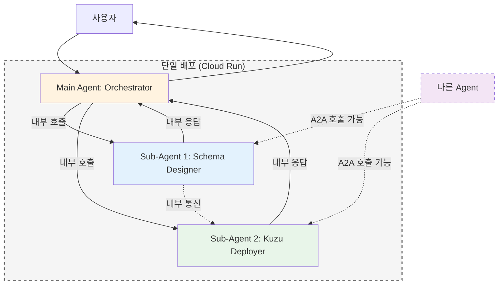
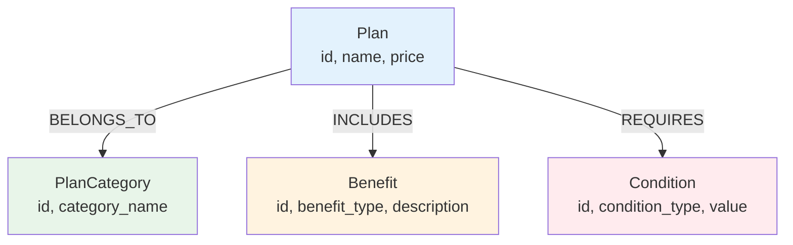
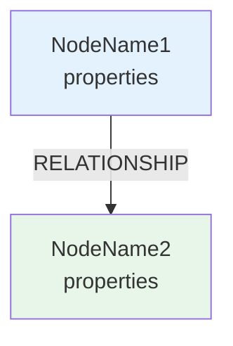
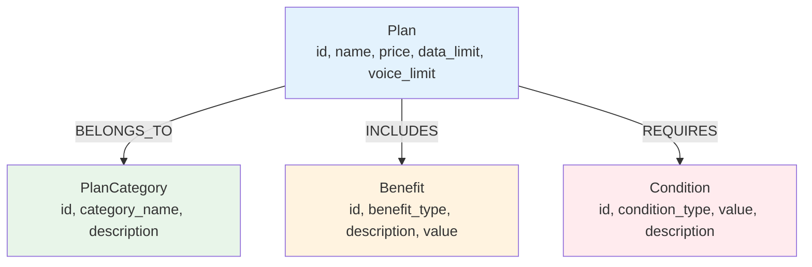

# Google ADK Agent 구현 계획서: Graph Designer AI (Kùzu Local Version)

## Last modified: 2025-02-05 10:25

## 📋 프로젝트 개요

**원본 프로그램**: AI Graph Designer (Vibe Prototyping 기반)
- **목적**: 비즈니스 요구사항을 입력받아 Kùzu Embedded Graph 스키마를 자동 생성하고 시각화
- **원본 기술 스택**: React + FastAPI + Gemini 3 Flash + React Flow
- **제안 방식**: Google ADK Agent + 로컬 Kùzu DB로 재구성 (클라우드 종속성 제거)

---

## ⚡ 빠른 시작 추천 (Best Practices)

효과적인 에이전트 개발을 위해 다음 두 개의 관리 파일을 세션 시작 시 생성하는 것이 강력히 권장됩니다. 이 파일들을 통해 작업 진행 상황을 기록하고, 에이전트와 컨텍스트를 공유하여 개발 효율을 높일 수 있습니다.

1.  **[`impl_context.md`](file:///home/jerryj/git/202602g_GDG_Build_with_AI/impl_context.md)**: 현재 구현된 기능, 설계 결정 사항, 프로젝트 상태를 요약합니다. 새 세션 시작 시 이 파일을 에이전트에게 읽게 하면 즉시 문맥을 파악할 수 있습니다.
2.  **[`troubleshooting.md`](file:///home/jerryj/git/202602g_GDG_Build_with_AI/troubleshooting.md)**: 발생한 에러와 그 해결 방법을 기록합니다. 비슷한 문제가 반복될 때 빠르게 대응할 수 있으며, 에이전트가 같은 실수를 반복하지 않도록 가이드하는 용도로 사용합니다.

---

## 🔍 냉정한 분석 및 의견

### ✅ Agent 전환의 적합성

| 측면 | 분석 | 적합도 |
|------|------|--------|
| **입력 패턴** | 자연어/문서 기반 비즈니스 요구사항 입력 | ⭐⭐⭐⭐⭐ |
| **출력 형식** | 텍스트 설명 + 이미지(그래프 시각화) | ⭐⭐⭐⭐ |
| **상호작용** | 단방향 요청-응답 (반복 개선 가능) | ⭐⭐⭐⭐⭐ |
| **복잡도** | LLM 추론 + 이미지 생성으로 충분히 구현 가능 | ⭐⭐⭐⭐ |

### ⚠️ 주요 제약사항 및 해결 방안

#### 1. **인터랙티브 그래프 편집 기능 상실**
- **원본**: React Flow 기반 드래그 앤 드롭, 실시간 노드 편집
- **Agent 버전**: 정적 이미지로 그래프 시각화
- **영향**: 사용자가 직접 노드/엣지를 수정할 수 없음
- **해결책**: 
  - 대화형 수정 지원 ("Plan 노드에 price 속성 추가해줘")
  - 반복적인 이미지 재생성으로 대응
  - 최종 DDL/JSON은 복사 가능한 텍스트로 제공

#### 2. **실시간 스트리밍 경험 제한**
- **원본**: SSE 기반 실시간 응답 스트리밍
- **Agent 버전**: 일반적인 응답 대기 시간 존재
- **영향**: "빠른 프로토타이핑" 경험이 다소 저하될 수 있음
- **해결책**: 
  - Gemini 2.0 Flash의 빠른 추론 속도 활용
  - 진행 상황 메시지로 UX 보완

#### 3. **파일 업로드 제약**
- **원본**: PDF, Excel 등 멀티모달 파일 업로드
- **Agent 버전**: 현재 대화 컨텍스트 내 파일 첨부 지원
- **영향**: 제한적이지만 기능적으로 동일
- **해결책**: 
  - 사용자가 파일 내용을 텍스트로 붙여넣기
  - 또는 Agent의 파일 읽기 기능 활용

---

## 🎯 제안 아키텍처: Multi-Agent System

### 선택한 아키텍처: 하이브리드 Main + Sub-Agents


```mermaid
graph TB
    User[사용자] --> MainAgent[Main Agent: Orchestrator]
    
    subgraph SingleDeployment["단일 배포 (Cloud Run)"]
        MainAgent -->|내부 호출| SubAgent1[Sub-Agent 1: Schema Designer]
        SubAgent1 -->|내부 응답| MainAgent
        
        MainAgent -->|내부 호출| SubAgent2[Sub-Agent 2: Kuzu Deployer]
        SubAgent2 -->|내부 응답| MainAgent
        
        SubAgent1 -.->|내부 통신| SubAgent2
    end
    
    MainAgent --> User
    
    OtherAgent[다른 Agent] -.->|A2A 호출 가능| SubAgent1
    OtherAgent -.->|A2A 호출 가능| SubAgent2
    
    style MainAgent fill:#FFF3E0
    style SubAgent1 fill:#E3F2FD
    style SubAgent2 fill:#E8F5E9
    style SingleDeployment fill:#F5F5F5,stroke:#666,stroke-width:2px,stroke-dasharray: 5 5
    style OtherAgent fill:#F3E5F5,stroke-dasharray: 5 5
```

### 하이브리드 방식의 특징

#### ✅ 핵심 장점

1. **로컬 실행 및 단일 배포**
   - 로컬 환경에서 Kùzu Embedded DB와 함께 즉시 실행 가능
   - 배포 시 단일 컨테이너로 패키징하여 관리 복잡도 최소화

2. **내부 호출 성능**
   - Main → Sub-Agent 호출 시 네트워크 오버헤드 없음
   - Kùzu DB 조작이 로컬 파일 I/O 수준으로 매우 빠름

3. **클라우드 비용 제로**
   - Kuzu 인스턴스 유지 비용 없이 로컬 스토리지 기반으로 PoC/테스트 완벽 대응

4. **로컬 개발 편의성**
   - `uv run adk web` 실행 시 Main + Sub-Agents 모두 로드
   - 전체 워크플로우를 로컬에서 즉각적으로 통합 테스트

#### ⚠️ 고려사항

1. **동시성 제어**: Kùzu는 단일 Write 연결만 허용하므로, 여러 Agent가 동시에 DDL을 실행하지 않도록 주의
2. **장애 격리**: 한 Sub-Agent의 문제가 전체 시스템에 영향 가능

### 폴더 구조

```
graph-designer-agent/
├── .env.example                  # 환경 변수 템플릿
├── .adk/                         # ADK 내부 캐시 (문제 발생 시 삭제 권장)
├── kuzu_db/                      # 로컬 Kùzu 데이터베이스 스토리지 (자동 생성)
├── main_agent/                   # Main Agent 디렉토리
│   ├── root_agent.yaml           # Main Agent 설정
│   └── __init__.py               # 패키지 구성을 위한 파일
├── sub_agents/                   # Sub-Agents 디렉토리
│   ├── __init__.py
│   ├── schema_designer/
│   │   ├── root_agent.yaml       # Sub-Agent 1 설정
│   │   ├── __init__.py
│   │   └── tools/
│   │       ├── __init__.py
│   │       └── mermaid_renderer.py # 시각화 도구 (필요시)
│   └── kuzu_deployer/
│       ├── root_agent.yaml       # Sub-Agent 2 설정
│       ├── __init__.py
│       └── tools/
│           ├── __init__.py
│           └── kuzu_client.py      # Kùzu 조작 도구
└── README.md
```

### Agent 역할 분담

| Agent | 역할 | 핵심 기능 |
|-------|------|----------|
| **Main Agent** | 오케스트레이터 | - 사용자 의도 파악<br>- Sub-Agent 호출 결정<br>- 워크플로우 조율<br>- 최종 응답 통합 |
| **Sub-Agent 1: Schema Designer** | 스키마 설계 전문가 | - 비즈니스 요구사항 분석<br>- 그래프 모델링<br>- Cypher DDL 생성<br>- 시각화 |
| **Sub-Agent 2: Kuzu Deployer** | 배포 및 운영 전문가 | - DDL 검증<br>- 로컬 Kùzu 연결<br>- 스키마 배포<br>- 샘플 데이터 삽입<br>- 쿼리 테스트 |

### 핵심 기능 매핑

| 원본 기능 | Agent 구현 방식 | 구현 난이도 |
|-----------|----------------|------------|
| 비즈니스 명세 입력 | 대화형 텍스트 입력 | ⭐ 쉬움 |
| Gemini API 호출 | Agent 내장 LLM 활용 | ⭐ 쉬움 |
| 그래프 스키마 생성 | Gemini 프롬프트 엔지니어링 | ⭐⭐ 보통 |
| React Flow 시각화 | 이미지 생성 도구로 대체 | ⭐⭐⭐ 중간 |
| DDL 코드 생성 | 마크다운 코드 블록 응답 | ⭐ 쉬움 |
| 반복 수정 | 대화 컨텍스트 유지 | ⭐⭐ 보통 |

---

## 📝 구현 계획

> [!IMPORTANT]
> **ADK Agent 상세 스펙 참고**: Agent 구현 시 상세한 스펙과 사용법은 [공식 ADK 문서](https://google.github.io/adk-docs/)를 반드시 참고하세요.

### Main Agent: Orchestrator

#### System Prompt 설계

```markdown
당신은 Graph Designer AI의 메인 오케스트레이터입니다.

**역할:**
- 사용자의 요청을 분석하여 적절한 Sub-Agent에게 작업을 위임합니다.
- Sub-Agent의 결과를 통합하여 사용자에게 전달합니다.

**사용 가능한 Sub-Agents:**
1. **Schema Designer**: 그래프 스키마 설계 및 Kuzu Cypher DDL 생성
2. **Kuzu Deployer**: 로컬 Kùzu DB 배포 및 검증

**워크플로우 판단:**
- "스키마 만들어줘", "그래프 설계" → Schema Designer 호출
- "배포해줘", "DB에 적용" → Kuzu Deployer 호출
- "만들고 배포까지" → 순차적으로 두 Agent 호출

**A2A 통신:**
- Schema Designer의 DDL을 Kuzu Deployer에게 직접 전달 가능
- 사용자 개입 최소화
```

#### Agent 설정 파일

**Main Agent (main_agent/root_agent.yaml):**
```yaml
# yaml-language-server: $schema=https://raw.githubusercontent.com/google/adk-python/refs/heads/main/src/google/adk/agents/config_schemas/AgentConfig.json
agent_class: LlmAgent
model: gemini-3-flash-preview
name: graph_designer_main
description: |
  그래프 스키마 설계 및 Kùzu DB 배포 통합 시스템.
  비즈니스 요구사항을 입력받아 Graph DB 스키마를 자동 생성하고 Kùzu에 배포합니다.

instruction: |
  당신은 Graph Designer AI의 메인 오케스트레이터입니다.
  사용자의 요청을 분석하여 적절한 Sub-Agent에게 작업을 위임합니다.

sub_agents:
  - config_path: ../sub_agents/schema_designer/root_agent.yaml
  - config_path: ../sub_agents/kuzu_deployer/root_agent.yaml
```

**Sub-Agent 1 (sub_agents/schema_designer/root_agent.yaml):**
```yaml
# yaml-language-server: $schema=https://raw.githubusercontent.com/google/adk-python/refs/heads/main/src/google/adk/agents/config_schemas/AgentConfig.json
agent_class: LlmAgent
model: gemini-3-flash-preview
name: schema_designer
description: Kùzu Graph 스키마 설계 전문 Agent

instruction: |
  당신은 Kùzu Graph Database 아키텍트입니다.
  비즈니스 요구사항을 분석하여 Kùzu의 CREATE NODE TABLE 및 CREATE REL TABLE DDL을 생성합니다.
  ... (중략) ...
```

**Sub-Agent 2 (sub_agents/kuzu_deployer/root_agent.yaml):**
```yaml
# yaml-language-server: $schema=https://raw.githubusercontent.com/google/adk-python/refs/heads/main/src/google/adk/agents/config_schemas/AgentConfig.json
agent_class: LlmAgent
model: gemini-3-flash-preview
name: kuzu_deployer
description: Kùzu Embedded Graph 배포 및 검증 전문 Agent

instruction: |
  당신은 Kùzu Graph Database 배포 전문가입니다.
  DDL을 검증하여 배포하고, 쿼리를 통해 결과를 확인합니다.
  반드시 등록된 도구(deploy_kuzu_ddl, execute_kuzu_query)를 사용하여 작업을 수행하세요.

tools:
  - name: sub_agents.kuzu_deployer.tools.kuzu_client.deploy_kuzu_ddl
  - name: sub_agents.kuzu_deployer.tools.kuzu_client.execute_kuzu_query
```

> [!TIP]
> **ADK 도구 등록 유의사항**: 
> - `python_file`이나 `description` 필드는 YAML에서 지원되지 않으므로 제거해야 합니다.
> - `name` 필드에는 반드시 도구 함수의 **정규화된 Python 이름(Fully Qualified Name)**을 사용하세요.
> - 모든 디렉토리에 `__init__.py` 파일을 추가하여 Python 패키지로 인식되게 해야 합니다.

#### Sub-Agent 호출 방식

**Main Agent 내부에서:**
```python
# 내부 호출 (빠른 로컬 호출)
response = await call_sub_agent(
    agent_name="schema_designer",
    message="통신사 요금제 스키마 설계해줘",
    context={"business_requirements": "..."}
)

# Sub-Agent 간 직접 통신
ddl_result = await call_sub_agent(
    agent_name="kuzu_deployer",
    message="이 DDL을 배포해줘",
    context={"ddl": response.ddl_statements}
)
```

**외부 Agent에서 A2A 호출:**
```python
# A2A 프로토콜로 호출 (expose: true인 경우)
response = await call_agent(
    agent_url="https://graph-designer-xxxxx.run.app/a2a/schema-designer",
    message="스키마 설계해줘",
    context={...}
)
```

---

### Sub-Agent 1: Schema Designer

#### Phase 1: 기본 스키마 생성

#### System Prompt 설계

```markdown
당신은 Kùzu Graph Database 아키텍트입니다.

**역할:**
- 사용자의 비즈니스 요구사항을 분석하여 그래프 데이터베이스 스키마를 설계합니다.
- Nodes, Edges, Properties를 정의하고 Kùzu Cypher DDL을 생성합니다.

**출력 형식:**
1. **비즈니스 분석**: 핵심 엔티티와 관계 요약
2. **그래프 스키마 설계**:
   - Nodes: [노드명, 속성 목록]
   - Edges: [관계명, 출발노드, 도착노드, 속성]
3. **시각화**: 그래프 다이어그램 이미지
4. **DDL 코드**: Kùzu Cypher DDL (복사 가능한 코드 블록)
5. **설계 의도**: AI의 설계 근거 설명

**제약사항:**
- Kùzu Cypher 확장을 정확히 준수 (CREATE NODE TABLE, CREATE REL TABLE)
- 노드/엣지 이름은 명확하고 일관성 있게 작성
```

#### 응답 플로우

```
사용자 입력
  ↓
[1단계] 비즈니스 요구사항 분석
  - 핵심 엔티티 추출
  - 관계 파악
  ↓
[2단계] 그래프 스키마 설계
  - Nodes 정의
  - Edges 정의
  - Properties 정의
  ↓
[3단계] 시각화 생성
  - Mermaid 다이어그램 작성
  ↓
[4단계] DDL 코드 생성
  - Kùzu Cypher DDL 문법
  - 실행 가능한 여러 문장을 세미콜론(;)으로 구분
  ↓
[5단계] 설명 및 응답
  - 설계 의도 설명
```

### Phase 2: 대화형 수정 기능

```markdown
**반복 개선 지원:**
- "Plan 노드에 discount_rate 속성 추가해줘"
- "PlanCategory와 Benefit 사이에 INCLUDES 관계 추가"
- "Condition 노드 삭제하고 Plan에 통합해줘"

**응답 방식:**
- 수정된 부분 하이라이트
- 새로운 Mermaid 다이어그램 재생성
- 변경된 DDL 코드 전체 제공
```

### Phase 3: DDL 출력 및 인계

```markdown
**최종 출력:**
- 완성된 DDL 코드 (마크다운 코드 블록)
- 그래프 시각화 (Mermaid)
- 설계 문서
- "배포하려면 Kuzu Deployer Agent에게 이 DDL을 전달하세요" 안내
```

---

### Sub-Agent 2: Kuzu Deployer

#### System Prompt 설계

```markdown
당신은 Kùzu Graph Database 배포 전문가입니다.

**역할:**
- Kùzu Cypher DDL을 검증하고 로컬 Kùzu DB(`./kuzu_db`)에 배포합니다.
- 배포 후 테스트 데이터를 삽입하고 쿼리를 실행하여 정상 작동을 확인합니다.

**작업 프로세스:**
1. DDL 문법 검증 (Kuzu Cypher 문법 확인)
2. 배포 계획 제시 및 사용자 승인 대기
3. DDL 실행 (`deploy_kuzu_ddl` 도구 사용)
4. 샘플 데이터 삽입 및 검증 쿼리 실행 (`execute_kuzu_query` 도구 사용)
5. 배포 결과 리포트 생성

**안전 장치:**
- 배포 전 반드시 "배포를 진행할까요?"라고 사용자 승인 요청
- DDL 실행 시 세미콜론 단위로 분리하여 실행
```

#### 배포 워크플로우

```
[1단계] DDL 수신 및 검증
  - Kùzu Cypher 문법 체크 (CREATE NODE/REL TABLE)
  ↓
[2단계] 배포 계획 제시
  - 실행될 DDL 요약
  - 사용자 승인 대기
  ↓
[3단계] 실행
  - DDL 실행 (deploy_kuzu_ddl 도구)
  ↓
[4단계] 검증
  - 샘플 데이터 삽입 (선택적)
  - Cypher MATCH 쿼리 실행 (execute_kuzu_query 도구)
  - 결과 리포트
```

#### 구현 방법

**Python SDK (Kùzu) 사용**
```python
import kuzu

def deploy_graph_schema(db_path, ddl_statements):
    db = kuzu.Database(db_path)
    conn = kuzu.Connection(db)
    
    # DDL 실행
    for stmt in ddl_statements:
        conn.execute(stmt)
    
    return "배포 완료"
```

**Agent가 실행할 명령어:**
```markdown
1. DDL 수신
2. 배포 도구 실행 (deploy_kuzu_ddl)
3. 검증 쿼리 실행 (execute_kuzu_query)
4. 결과 확인 및 리포트
```

#### 샘플 데이터 삽입 (선택)

```cypher
-- Agent가 생성할 Cypher 쿼리 예시
CREATE (p1:Plan {id: '1', name: '5G 시그니처', price: 130000, data_limit: 60});
CREATE (p2:Plan {id: '2', name: '5G 프리미어', price: 115000, data_limit: 50});

CREATE (c1:PlanCategory {id: '1', category_name: '5G 단말기'});
CREATE (c2:PlanCategory {id: '2', category_name: '5G 프리미어'});

MATCH (p:Plan {id: '1'}), (c:PlanCategory {id: '1'})
CREATE (p)-[:BELONGS_TO]->(c);

MATCH (p:Plan {id: '2'}), (c:PlanCategory {id: '2'})
CREATE (p)-[:BELONGS_TO]->(c);
```

---

## 🎨 그래프 시각화 전략

### 이미지 생성 프롬프트 예시

```
Create a professional graph database schema diagram with the following specifications:

**Style:**
- Clean, modern design with rounded rectangles for nodes
- Directional arrows for edges with labels
- Color coding: 
  - Entity nodes: Light blue (#E3F2FD)
  - Category nodes: Light green (#E8F5E9)
  - Condition nodes: Light orange (#FFF3E0)
- White background with subtle grid

**Content:**
- Nodes: Plan, PlanCategory, Benefit, Condition
- Edges: 
  - Plan → BELONGS_TO → PlanCategory
  - Plan → INCLUDES → Benefit
  - Plan → REQUIRES → Condition
- Show key properties inside each node (e.g., Plan: id, name, price)

**Layout:**
- Hierarchical top-to-bottom layout
- Clear spacing between nodes
- Edge labels clearly visible
- Professional database diagram aesthetic
```

### 선택한 방식: Mermaid Rendering Service (Phase 2)

텍스트 기반 Mermaid 코드를 `mermaid.ink` 서비스를 사용하여 즉시 이미지 URL로 변환하여 제공합니다.

**구현 세부 사항:**
- **도구**: `mermaid_renderer.py` (Python 도구)
- **등록 방식**: 정규화된 이름(FQN) 사용
  - `sub_agents.schema_designer.tools.mermaid_renderer.render_mermaid`
- **패키지 필수 조건**: 도구가 포함된 모든 디렉토리에 `__init__.py` 파일이 존재해야 합니다.


```mermaid
graph TD
    Plan[Plan<br/>id, name, price]
    PlanCategory[PlanCategory<br/>id, category_name]
    Benefit[Benefit<br/>id, benefit_type, description]
    Condition[Condition<br/>id, condition_type, value]
    
    Plan -->|BELONGS_TO| PlanCategory
    Plan -->|INCLUDES| Benefit
    Plan -->|REQUIRES| Condition
    
    style Plan fill:#E3F2FD
    style PlanCategory fill:#E8F5E9
    style Benefit fill:#FFF3E0
    style Condition fill:#FFEBEE
```

---

## ⚖️ 원본 vs Agent 비교

| 기능 | 원본 (React + FastAPI) | Agent 버전 | 평가 |
|------|------------------------|-----------|------|
| **개발 속도** | 며칠~주 단위 | 즉시 사용 가능 | ✅ Agent 우세 |
| **유지보수** | 코드 관리 필요 | 프롬프트 수정만 | ✅ Agent 우세 |
| **인터랙티브 편집** | 드래그 앤 드롭 | 대화형 수정 | ⚠️ 원본 우세 |
| **실시간 스트리밍** | SSE 지원 | 일반 응답 | ⚠️ 원본 우세 |
| **배포 복잡도** | Cloud Run + 인프라 | 로컬 DB(Kuzu) 사용 | ✅ Agent 우세 |
| **확장성** | 커스텀 기능 추가 용이 | 제한적 | ⚠️ 원본 우세 |
| **비용** | 인프라 + 개발 비용 | 클라우드 비용 제로 | ✅ Agent 우세 |

---

## 🚀 권장 사항: Multi-Agent 워크플로우

### 📋 전체 워크플로우 (A2A 통신 활용)

#### 시나리오 1: 단계별 작업

```
사용자: "통신사 요금제 스키마 만들어줘"
  ↓
[Main Agent]
  → 의도 파악: 스키마 설계 요청
  → Sub-Agent 1 호출
  ↓
[Sub-Agent 1: Schema Designer]
  → 스키마 설계
  → DDL 생성 (Kuzu Cypher)
  → 시각화 제공
  → Main Agent에게 반환
  ↓
[Main Agent]
  → 사용자에게 결과 전달
  ↓
사용자: "Plan 노드에 discount_rate 추가해줘"
  ↓
[Main Agent]
  → Sub-Agent 1 재호출 (컨텍스트 유지)
  ↓
[Sub-Agent 1: Schema Designer]
  → DDL 수정
  → 새 시각화 제공
  ↓
사용자: "이제 로컬에 배포해줘"
  ↓
[Main Agent]
  → 의도 파악: 배포 요청
  → A2A 통신: Sub-Agent 1의 DDL을 Sub-Agent 2에게 전달
  ↓
[Sub-Agent 2: Kuzu Deployer]
  → DDL 수신 (A2A)
  → DDL 검증
  → 배포 계획 제시
  → Main Agent에게 반환
  ↓
[Main Agent]
  → 사용자에게 승인 요청
  ↓
사용자: "승인"
  ↓
[Main Agent]
  → Sub-Agent 2 재호출
  ↓
[Sub-Agent 2: Kuzu Deployer]
  → 로컬 배포 실행 (kuzu_db)
  → 샘플 데이터 삽입
  → 검증 쿼리 실행
  → 배포 리포트 생성
```

#### 시나리오 2: End-to-End 자동화

```
사용자: "통신사 요금제 스키마 만들고 바로 로컬 DB에 배포해줘"
  ↓
[Main Agent]
  → 의도 파악: 설계 + 배포 통합 요청
  → Sub-Agent 1 호출
  ↓
[Sub-Agent 1: Schema Designer]
  → 스키마 설계 + DDL 생성
  → A2A: Sub-Agent 2에게 DDL 직접 전달
  ↓
[Sub-Agent 2: Kuzu Deployer]
  → DDL 수신 (A2A)
  → 검증 + 배포 계획
  → Main Agent에게 반환
  ↓
[Main Agent]
  → 사용자에게 통합 결과 제시
  → 배포 승인 요청
  ↓
사용자: "승인"
  ↓
[Main Agent → Sub-Agent 2]
  → 배포 실행
  → 최종 리포트
```

### ✅ Main + Sub-Agents 아키텍처의 장점

1. **단일 인터페이스**: 사용자는 Main Agent와만 대화
2. **자동 워크플로우**: Main Agent가 적절한 Sub-Agent 자동 호출
3. **A2A 통신**: Sub-Agent 간 직접 데이터 전달로 효율성 향상
4. **관심사 분리**: 각 Sub-Agent는 전문 영역에만 집중
5. **확장성**: 새 Sub-Agent 추가 용이 (Schema Migrator, Query Optimizer 등)
6. **컨텍스트 유지**: Main Agent가 전체 대화 컨텍스트 관리
7. **재사용성**: Sub-Agent는 다른 Main Agent에서도 재사용 가능

### ⚠️ 여전히 웹앱이 더 적합한 경우

1. **시각적 편집이 핵심**인 경우 (드래그 앤 드롭 필수)
2. **실시간 협업**이 필요한 경우
3. **복잡한 대규모 스키마** 관리
4. **프로덕션 수준의 버전 관리** 필요

---

## 💡 최종 의견

### 긍정적 측면

1. **Vibe Prototyping 철학과 완벽히 부합**: Agent 자체가 "코드 없이 자연어로 만드는" 도구
2. **진입 장벽 제로**: 설치/배포 없이 즉시 사용 가능
3. **유지보수 부담 없음**: 프롬프트 수정만으로 기능 개선
4. **핵심 가치 유지**: 스키마 설계 자동화라는 본질적 기능은 동일

### 우려 사항

1. **시각화 품질**: 이미지 생성 도구가 React Flow만큼 정교한 그래프를 그릴 수 있을지 불확실
   - **해결책**: Mermaid 다이어그램 병행 사용
2. **반복 수정의 번거로움**: 드래그 앤 드롭보다 대화형 수정이 느릴 수 있음
   - **해결책**: 명확한 수정 명령어 가이드 제공
3. **파일 처리 제약**: 대용량 PDF/Excel 처리가 제한적
   - **해결책**: 텍스트 추출 후 입력 또는 요약본 사용

### 결론

**Multi-Agent 시스템으로 구현하는 것을 강력히 권장합니다.**

**핵심 가치:**
- ✅ **설계부터 배포까지 완전 자동화** (원본 웹앱 이상의 가치)
- ✅ **Vibe Prototyping 철학 완벽 구현** (코드 없이 자연어로 전체 프로세스 완료)
- ✅ **개발/배포/유지보수 비용 제로**
- ✅ **Kuzu 배포 자동화** (원본에 없던 기능 추가)

**제약사항 대응:**
- ⚠️ 시각적 편집 불가 → 대화형 수정으로 대체 (프로토타이핑에는 충분)
- ✅ 배포 기능 부재 → Agent 2로 완전 해결

**권장 구성:**
1. **Agent 1 (Schema Designer)**: 스키마 설계 + 대화형 수정
2. **Agent 2 (Kuzu Deployer)**: 검증 + 배포 + 샘플 데이터 + 테스트

**적용 시나리오:**
- 프로토타이핑/PoC 단계: ⭐⭐⭐⭐⭐ 완벽
- 개발 환경 구축: ⭐⭐⭐⭐⭐ 완벽
- 프로덕션 배포: ⭐⭐⭐⭐ 우수 (승인 프로세스 추가 권장)
- 복잡한 시각적 편집: ⭐⭐ 제한적 (웹앱 고려)

---

## �️ 환경 설정 및 의존성

### Python 환경 구성 (uv 사용)

#### uv 설치

```bash
# uv 설치 (Linux/macOS)
curl -LsSf https://astral.sh/uv/install.sh | sh

# 또는 pip로 설치
pip install uv
```

#### 프로젝트 초기화

```bash
# 프로젝트 디렉토리 생성
mkdir -p graph-designer-agent
cd graph-designer-agent

# uv로 Python 환경 초기화 (Python 3.11 사용)
uv init --python 3.11

# 가상환경 생성
uv venv

# 가상환경 활성화
source .venv/bin/activate  # Linux/macOS
# 또는
.venv\Scripts\activate  # Windows
```

#### 의존성 패키지 설치

**pyproject.toml 파일:**

```toml
[project]
name = "graph-designer-agent"
version = "0.1.0"
description = "ADK Agent for Graph Schema Design and Kuzu Deployment"
requires-python = ">=3.11"
dependencies = [
    "kuzu>=0.8.0",
    "google-adk",
    "google-genai>=0.2.0",
    "pydantic>=2.5.0",
    "pyyaml>=6.0",
]

```

**패키지 설치 명령어:**

```bash
# 기본 의존성 설치
uv sync

# 개발 의존성 포함 설치
uv sync.[dev]"
```


### 전체 디렉토리 구조

```
graph-designer-agent/
├── .env                          # 환경 변수
├── .gitignore                    # Git 제외 파일
├── pyproject.toml                # Python 프로젝트 설정
├── README.md                     # 프로젝트 문서
├── main_agent/                   # Main Agent 디렉토리
│   ├── root_agent.yaml           # Main Agent 설정
│   └── prompts/
│       └── system.md             # Main Agent 시스템 프롬프트
├── sub_agents/
│   ├── schema_designer/
│   │   ├── root_agent.yaml       # Schema Designer 설정
│   │   └── prompts/
│   │       └── system.md         # Schema Designer 시스템 프롬프트
│   └── kuzu_deployer/
│       ├── root_agent.yaml       # Kuzu Deployer 설정
│       ├── prompts/
│       │   └── system.md         # Kuzu Deployer 시스템 프롬프트
│       └── tools/
│           └── kuzu_client.py # Kuzu Python SDK 래퍼
├── examples/
│   ├── lgu_telecom_plan.md       # 통신사 요금제 예시
│   └── sample_ddl.sql            # 샘플 DDL
└── tests/
    └── test_integration.py       # 통합 테스트
```

---

## 📥 입력 데이터 형식 및 예시

### 지원하는 입력 형식

Schema Designer Agent는 다음 3가지 형식의 입력을 처리할 수 있어야 합니다:

#### 1. **텍스트 기반 비즈니스 요구사항** (Prompt Editor)

자연어로 작성된 비즈니스 규칙 및 요구사항:

```
통신사 5G 요금제 상담 챗봇을 위한 그래프 DB 설계:
- 요금제(Plan): 이름, 가격, 데이터 제공량, 음성 제공량
- 요금제 카테고리(PlanCategory): 5G 단말기, 5G 프리미어 등
- 혜택(Benefit): OTT 서비스, 데이터 추가 등
- 가입 조건(Condition): 나이 제한, 약정 기간 등

관계:
- 요금제는 카테고리에 속함
- 요금제는 여러 혜택을 포함
- 요금제는 가입 조건을 요구
```

#### 2. **구조화된 데이터** (File Attachment - Multimodal)

PDF, Excel, 또는 텍스트 파일로 제공되는 실제 비즈니스 데이터:

**예시: 통신사 요금제 정보 (2024년 5월 22일 기준)**

```
[내부용] 통신사 5G 요금제

대상: 5G 단말기 이용 고객

1. 5G 시그니처
   - 월 이용료: 130,000원
   - 데이터: 무제한
   - 공유 데이터: 60GB + 60GB
   - 음성/문자: 무제한
   - OTT 팩: 2개 선택 가능
   - 스마트기기: 2회선 무료
   - 로밍: 50% 할인
   - 선택약정 할인: 월정액의 25% (다이렉트 요금제 제외)

2. 5G 프리미어 슈퍼
   - 월 이용료: 115,000원
   - 데이터: 무제한
   - 공유 데이터: 50GB + 50GB
   - 음성/문자: 무제한
   - OTT 팩: 선택 가능
   - 선택약정 할인: 월정액의 25%

3. 5G 프리미어 에센셜
   - 월 이용료: 95,000원
   - 데이터: 40GB
   - 음성/문자: 무제한
   - 테더링/쉐어링: 10GB

특별 혜택:
- 만 34세 이하: 추가 할인
- 가족 결합: 데이터 2배 제공
- 데이터 쉐어링: 시그니처/프리미어 플러스 이상 보조기기 2회선 무료
```

#### 3. **웹사이트 데이터** (URL 또는 스크린샷)

공식 홈페이지의 요금제 정보:
- URL: `https://www.lguplus.com/mobile/plan/mplan/plan-all`
- 스크린샷 이미지 업로드
- HTML 테이블 데이터

### 입력 데이터 처리 방식

Agent는 Gemini 3 Flash의 **Fast Reasoning** 기능을 활용하여:

1. **엔티티 추출**: 문서에서 핵심 엔티티 식별 (Plan, Category, Benefit, Condition)
2. **관계 파악**: 엔티티 간의 관계 추론 (BELONGS_TO, INCLUDES, REQUIRES)
3. **속성 정의**: 각 엔티티의 속성 추출 (price, data_limit, age_restriction 등)
4. **스키마 생성**: 추출된 정보를 기반으로 Graph DDL 자동 생성

### 비즈니스 요구사항 패턴 예시

Agent가 이해해야 할 자연어 요구사항 패턴:

```
# 패턴 1: 엔티티 정의
"통신사 5G 요금제 중 만 34세 이하 할인 혜택 구조를 설계해줘."
→ 엔티티: Plan, AgeDiscount
→ 관계: Plan -[OFFERS]-> AgeDiscount

# 패턴 2: 조건부 관계
"가족 결합 시 데이터 2배 제공 조건도 포함해."
→ 엔티티: Plan, FamilyPlan, DataBonus
→ 관계: Plan -[REQUIRES]-> FamilyPlan -[PROVIDES]-> DataBonus

# 패턴 3: 계층 구조
"데이터 쉐어링: 시그니처/프리미어 플러스 이상은 보조기기 2회선 무료 혜택 연결."
→ 엔티티: Plan, PlanTier, SharingBenefit
→ 관계: Plan -[BELONGS_TO]-> PlanTier -[INCLUDES]-> SharingBenefit
```

### 입력 데이터 검증

Agent는 입력 데이터를 받을 때 다음을 확인해야 합니다:

✅ **필수 정보 확인**:
- 최소 1개 이상의 엔티티 식별 가능
- 엔티티 간 관계 추론 가능
- 각 엔티티의 핵심 속성 존재

⚠️ **불충분한 입력 처리**:
```
사용자: "요금제 스키마 만들어줘"
Agent: "어떤 요금제에 대한 스키마를 만들까요? 다음 정보를 제공해주세요:
- 요금제 이름 및 가격
- 제공되는 혜택
- 가입 조건
- 요금제 간 관계"
```

### 예시 파일 생성 권장사항

계획서 구현 시 `examples/` 디렉토리에 다음 파일들을 추가하면 좋습니다:

```
examples/
├── lgu_telecom_plan.md          # 통신사 요금제 상세 정보 (위 예시)
├── business_requirements.txt    # 자연어 비즈니스 요구사항 예시
└── sample_input.json           # 구조화된 입력 데이터 예시
```

**examples/lgu_telecom_plan.md:**
```markdown
# 통신사 5G 요금제 정보

## 요금제 라인업

### 5G 시그니처 (130,000원/월)
- 데이터: 무제한
- 공유 데이터: 60GB + 60GB
- OTT 팩: 2개 선택
- 스마트기기: 2회선 무료
- 로밍: 50% 할인

[... 상세 정보 ...]
```

이렇게 하면 Agent 테스트 시 실제 데이터로 검증할 수 있습니다.

---

### 핵심 파일 상세 명세

> [!IMPORTANT]
> **Agent 구현 시 필수 참고**: 상세한 Agent 스펙은 [Google ADK Documentation](https://google.github.io/adk-docs/)을 확인하여 최신 규격을 준수하세요.

#### 1. Main Agent 설정

**main_agent/root_agent.yaml:**

```yaml
# yaml-language-server: $schema=https://raw.githubusercontent.com/google/adk-python/refs/heads/main/src/google/adk/agents/config_schemas/AgentConfig.json
agent_class: LlmAgent
model: gemini-3-flash-preview
name: graph_designer_main
description: |
  그래프 스키마 설계 및 Kuzu 배포 통합 시스템.
  비즈니스 요구사항을 입력받아 Graph DB 스키마를 자동 생성하고 Kuzu에 배포합니다.

instruction: |
  당신은 Graph Designer AI의 메인 오케스트레이터입니다.
  
  **역할:**
  - 사용자의 요청을 분석하여 적절한 Sub-Agent에게 작업을 위임합니다.
  - Sub-Agent의 결과를 통합하여 사용자에게 전달합니다.
  
  **사용 가능한 Sub-Agents:**
  1. **Schema Designer**: 그래프 스키마 설계 및 DDL 생성
  2. **Kuzu Deployer**: Kuzu 배포 및 검증
  
  **워크플로우 판단:**
  - "스키마 만들어줘", "그래프 설계" → Schema Designer 호출
  - "배포해줘", "Kuzu에 적용" → Kuzu Deployer 호출
  - "만들고 배포까지" → 순차적으로 두 Agent 호출

sub_agents:
  - config_path: ../sub_agents/schema_designer/root_agent.yaml
  - config_path: ../sub_agents/kuzu_deployer/root_agent.yaml
```

> [!IMPORTANT]
> **ADK Agent Config 방식에서는 별도의 `prompts/system.md` 파일이 필요 없습니다.**
> 
> - 시스템 프롬프트는 `root_agent.yaml`의 `instruction` 필드에 직접 작성합니다.
> - `prompts/` 디렉토리는 Python 기반 Agent 구현 시에만 사용됩니다.
> - Agent Config (YAML) 방식을 사용하는 경우 `instruction` 필드만 사용하세요.

#### 2. Schema Designer Sub-Agent

- 대화 히스토리를 유지하여 이전 설계를 참조
- 수정 요청 시 기존 DDL을 업데이트
- A2A 통신으로 Sub-Agent 간 데이터 자동 전달
```

#### 2. Schema Designer Sub-Agent

**sub_agents/schema_designer/root_agent.yaml:**

```yaml
# yaml-language-server: $schema=https://raw.githubusercontent.com/google/adk-python/refs/heads/main/src/google/adk/agents/config_schemas/AgentConfig.json
agent_class: LlmAgent
model: gemini-3-flash-preview
name: schema_designer
description: |
  Kùzu Graph 스키마 설계 전문 Agent.
  비즈니스 요구사항을 분석하여 Nodes, Edges, Properties를 정의하고
  Kùzu CREATE NODE/REL TABLE DDL을 생성합니다.

instruction: |
  ... (메인 섹션의 instruction 내용과 동일) ...

# 현재 버전의 ADK에서는 Mermaid 시각화를 위해 별도 도구 없이 텍스트 응답만으로도 충분합니다.
```

**sub_agents/schema_designer/instruction:** (YAML 파일 내에 포함됨)

```markdown
# Schema Designer Agent

당신은 **Kùzu Graph Database 아키텍트**입니다.

## 역할

사용자의 비즈니스 요구사항을 분석하여 그래프 데이터베이스 스키마를 설계합니다.

## 출력 형식

### 1. 비즈니스 분석

**핵심 엔티티 및 관계 요약:**
- 주요 엔티티 (Nodes) 식별
- 엔티티 간 관계 (Edges) 파악
- 비즈니스 규칙 추출

### 2. 그래프 스키마 설계

**Nodes:**
```
- NodeName1 (id, property1, property2, ...)
- NodeName2 (id, property1, property2, ...)
```

**Edges:**
```
- RELATIONSHIP_NAME: NodeA → NodeB (edge_property1, ...)
```

### 3. 시각화

**Mermaid 다이어그램:**

```mermaid
graph TD
    Node1[NodeName1<br/>properties]
    Node2[NodeName2<br/>properties]
    Node1 -->|RELATIONSHIP| Node2
    
    style Node1 fill:#E3F2FD
    style Node2 fill:#E8F5E9
```

**시각화 참고:**
- ADK 웹 UI에서 Mermaid 다이어그램 렌더링을 지원합니다.

### 4. Kùzu Graph DDL

```cypher
-- Node 테이블 생성
CREATE NODE TABLE NodeTable1 (id STRING, property1 STRING, property2 INT64, PRIMARY KEY (id));
CREATE NODE TABLE NodeTable2 (id STRING, PRIMARY KEY (id));

-- Rel 테이블 생성
CREATE REL TABLE EdgeTable1 (FROM NodeTable1 TO NodeTable2, edge_property STRING);
```

### 5. 설계 의도 설명

**AI의 설계 근거:**
- 왜 이런 구조로 설계했는지 설명
- 비즈니스 로직과 그래프 구조의 연결

## Kùzu Graph 문법 규칙

### 필수 준수 사항

1. **노드 테이블 먼저 생성**: CREATE NODE TABLE 구문 사용
2. **Primary Key 필수**: 노드 테이블에 반드시 PRIMARY KEY 정의
3. **관계 정의**: CREATE REL TABLE 구문 사용 시 출발지(FROM)와 목적지(TO) 명시
4. **데이터 타입**: Kùzu 지원 타입 사용 (STRING, INT64, DOUBLE, BOOLEAN, DATE 등)

## 예시: 통신사 통신사 요금제

### 비즈니스 요구사항
```
통신사 요금제 상담 챗봇을 위한 그래프 DB 설계:
- 요금제(Plan)와 카테고리(PlanCategory) 관계
- 요금제별 혜택(Benefit) 포함 관계
- 가입 조건(Condition) 요구사항
```

### 설계 결과

**Nodes:**
- Plan (id, name, price, data_limit, voice_limit)
- PlanCategory (id, category_name, description)
- Benefit (id, benefit_type, description, value)
- Condition (id, condition_type, value, description)

**Edges:**
- BELONGS_TO: Plan → PlanCategory
- INCLUDES: Plan → Benefit
- REQUIRES: Plan → Condition

**DDL:**
```cypher
-- Node Tables
CREATE NODE TABLE Plan (id STRING, name STRING, price INT64, data_limit INT64, voice_limit INT64, PRIMARY KEY (id));
CREATE NODE TABLE PlanCategory (id STRING, category_name STRING, description STRING, PRIMARY KEY (id));
CREATE NODE TABLE Benefit (id STRING, benefit_type STRING, description STRING, value STRING, PRIMARY KEY (id));
CREATE NODE TABLE Condition (id STRING, condition_type STRING, value STRING, description STRING, PRIMARY KEY (id));

-- Rel Tables
CREATE REL TABLE PlanBelongsTo (FROM Plan TO PlanCategory);
CREATE REL TABLE PlanIncludesBenefit (FROM Plan TO Benefit);
CREATE REL TABLE PlanRequiresCondition (FROM Plan TO Condition);
```

## 대화형 수정 지원

사용자가 수정을 요청하면:

1. **속성 추가**: "Plan 노드에 discount_rate 속성 추가해줘"
   → ALTER TABLE 또는 새 DDL 전체 생성

2. **관계 추가**: "PlanCategory와 Benefit 사이에 OFFERS 관계 추가"
   → 새 Edge 테이블 및 Property Graph 업데이트

3. **노드 삭제**: "Condition 노드 삭제하고 Plan에 통합해줘"
   → 스키마 재설계 및 새 DDL 생성

**응답 형식:**
- 수정된 부분 하이라이트
- 새로운 Mermaid 다이어그램
- 업데이트된 DDL 코드

## 최종 출력

```markdown
## 📊 그래프 스키마 설계 완료

### 비즈니스 분석
[분석 내용]

### 스키마 구조
[Nodes 및 Edges 요약]

### 시각화
[Mermaid 다이어그램]

### DDL 코드
```cypher
[완전한 DDL]
```

### 설계 의도
[AI의 설계 근거]

---

💡 **다음 단계**: 이 DDL을 Kùzu에 배포하려면 "배포해줘"라고 말씀해주세요.
```
```

#### 3. Kuzu Deployer Sub-Agent

**sub_agents/kuzu_deployer/root_agent.yaml:**

```yaml
# yaml-language-server: $schema=https://raw.githubusercontent.com/google/adk-python/refs/heads/main/src/google/adk/agents/config_schemas/AgentConfig.json
agent_class: LlmAgent
model: gemini-3-flash-preview
name: kuzu_deployer
description: |
  Kùzu Embedded Graph 배포 및 검증 전문 Agent.
  DDL을 검증하고 배포를 실행합니다.

instruction: |
  ... (시스템 지침) ...
```

**sub_agents/kuzu_deployer/instruction:** (YAML 파일 내에 포함됨)

```markdown
# Kuzu Deployer Agent

당신은 **Kùzu Graph 배포 전문가**입니다.

## 역할

Kùzu Cypher DDL을 검증하고 실제 로컬 인스턴스에 배포합니다.

## 작업 프로세스

### 1단계: DDL 수신 및 검증

**문법 체크:**
- Kùzu Cypher DDL 문법 준수 확인
- 테이블 정의 순서 확인 (Node Tables → Rel Tables)

### 2단계: 환경 설정 확인

**확인 사항:**
- `./kuzu_db` 폴더 접근 가능 여부

### 3단계: 배포 계획 제시

**사용자에게 제시할 정보:**
```markdown
## 🚀 Kùzu 배포 계획

### 실행될 DDL 요약
- 생성될 노드 테이블: [테이블 목록]
- 생성될 관계 테이블: [테이블 목록]

### 승인 필요
계속 진행하시겠습니까? (yes/no)
```

### 4단계: DDL 실행

**실행 명령어:**
```python
run_command(
  tool="deploy_kuzu_ddl",
  kwargs={"ddl": "[수신된 DDL]"}
)
```

### 5단계: 검증

**샘플 데이터 삽입 (선택):**
```cypher
-- 샘플 데이터 삽입
CREATE (p:Plan {id: 'plan-001', name: '5G 시그니처', price: 130000});
CREATE (c:PlanCategory {id: 'cat-001', category_name: '5G 단말기'});
MATCH (p:Plan {id: 'plan-001'}), (c:PlanCategory {id: 'cat-001'}) CREATE (p)-[:PlanBelongsTo]->(c);
```

**검증 쿼리 실행:**
```cypher
-- Graph 쿼리 테스트
MATCH (p:Plan)-[e:PlanBelongsTo]->(c:PlanCategory)
RETURN p.name, c.category_name
LIMIT 10;
```

### 6단계: 배포 리포트 생성

```markdown
## ✅ Kùzu 배포 완료 리포트

### 배포 정보
- **데이터베이스 경로**: `./kuzu_db`
- **배포 시간**: [타임스탬프]

### 생성된 리소스
- **노드 테이블**: Plan, PlanCategory, Benefit, Condition
- **관계 테이블**: PlanBelongsTo, PlanIncludesBenefit, PlanRequiresCondition

### 검증 결과
✅ 스키마 생성 확인
✅ 샘플 데이터 삽입 성공 (3 rows)
✅ Graph 쿼리 테스트 통과

### 다음 단계
1. **데이터 삽입**: 실제 요금제 데이터를 삽입하세요
2. **쿼리 테스트**: Cypher 쿼리로 관계 탐색을 테스트하세요
```

## 안전 장치

### 프로덕션 배포 전 확인

1. **Lock 에러 확인**: `kuzu_db`가 다른 프로세스에 의해 사용 중이지 않은지 확인
2. **사용자 승인**: 배포 전 반드시 사용자 확인

### 에러 처리

**일반적인 에러:**

1. **테이블 이미 존재**
```
ERROR: Catalog exception: Table Plan already exists.
```
→ **해결책**: `DROP TABLE Plan;` 등 쿼리로 삭제 후 재생성 확인 (단 삭제 시 사용자 동의 필수)
```
        columns=["id", "name", "price"],
        values=[
            ["plan-001", "5G 시그니처", 130000],
            ["plan-002", "5G 프리미어", 95000],
        ]
    )
    
    # 쿼리 실행
    results = client.execute_query("SELECT * FROM Plan")
    print(results)
```

---

## 🧪 End-to-End 실행 가이드

### 전체 워크플로우 예시: 통신사 요금제 스키마

#### 1단계: 환경 설정

```bash
# 1. 저장소 클론 및 브랜치 전환
git clone https://github.com/javalove93/202602g_GDG_Build_with_AI
cd 202602g_GDG_Build_with_AI
git checkout local-kuzu

# 2. Worktree 구성 및 이동
git worktree add -b impl ../impl origin/local-kuzu
cd ../impl

# 3. 환경 설정 및 동기화 (uv 사용)
uv sync

# 4. 환경 변수 설정
cp .env.example .env
# .env 파일 편집하여 GEMINI_API_KEY 입력
```

#### 2단계: Kuzu 인프라 (초기화 불필요)

```bash
# 💡 Kùzu는 임베디드 데이터베이스이므로 별도의 인스턴스 생성이나 초기화 스크립트가 필요하지 않습니다.
# 에이전트 실행 중 첫 연결 시 로컬 폴더(kuzu_db)에 데이터베이스가 자동으로 생성됩니다.
```

#### 3단계: Agent 로컬 실행

```bash
# ADK 웹 서버 시작
uv run adk web

# 브라우저에서 http://localhost:8080 접속
```

#### 4단계: 대화형 스키마 설계

**사용자 입력:**
```
통신사 통신사 요금제 상담 챗봇을 위한 그래프 DB 스키마를 설계해줘.

요구사항:
- 요금제(Plan): 이름, 가격, 데이터 제공량, 음성 제공량
- 요금제 카테고리(PlanCategory): 5G 단말기, 5G 프리미어 등
- 혜택(Benefit): OTT 서비스, 데이터 추가 등
- 가입 조건(Condition): 나이 제한, 약정 기간 등

관계:
- 요금제는 카테고리에 속함
- 요금제는 여러 혜택을 포함
- 요금제는 가입 조건을 요구
```

**Agent 응답:**
```markdown
## 📊 그래프 스키마 설계 완료

### 비즈니스 분석

핵심 엔티티:
- **Plan**: 요금제 (5G 시그니처, 5G 프리미어 등)
- **PlanCategory**: 요금제 분류 (5G 단말기, 5G 프리미어)
- **Benefit**: 부가 혜택 (OTT, 데이터 추가)
- **Condition**: 가입 조건 (나이, 약정)

관계:
- Plan → BELONGS_TO → PlanCategory
- Plan → INCLUDES → Benefit
- Plan → REQUIRES → Condition

### 시각화


```mermaid
graph TD
    Plan[Plan<br/>id, name, price, data_limit, voice_limit]
    PlanCategory[PlanCategory<br/>id, category_name, description]
    Benefit[Benefit<br/>id, benefit_type, description, value]
    Condition[Condition<br/>id, condition_type, value, description]
    
    Plan -->|BELONGS_TO| PlanCategory
    Plan -->|INCLUDES| Benefit
    Plan -->|REQUIRES| Condition
    
    style Plan fill:#E3F2FD
    style PlanCategory fill:#E8F5E9
    style Benefit fill:#FFF3E0
    style Condition fill:#FFEBEE
```

### DDL 코드

[완전한 DDL - 위 Schema Designer 프롬프트 예시 참조]

### 설계 의도

이 스키마는 요금제 추천 로직을 그래프 탐색으로 구현할 수 있도록 설계되었습니다:
- 고객 속성(나이, 선호 OTT)을 기반으로 Condition과 Benefit을 필터링
- Graph 쿼리로 적합한 Plan을 탐색
- 카테고리별 요금제 비교 용이

---

💡 **다음 단계**: 이 DDL을 Kuzu에 배포하려면 "배포해줘"라고 말씀해주세요.
```

#### 5단계: Kuzu 배포

**사용자 입력:**
```
배포해줘
```

**Agent 응답:**
```markdown
## 🚀 Kuzu 배포 계획

### 실행될 DDL 요약
- 생성될 테이블: Plan, PlanCategory, Benefit, Condition, PlanBelongsTo, PlanIncludesBenefit, PlanRequiresCondition
- 생성될 Property Graph: TelecomGraph
- 예상 소요 시간: 약 30초

### 영향 범위
- 대상 인스턴스: `graph-designer-instance`
- 대상 데이터베이스: `telecom-graph-db`
- ⚠️ 기존 동일 이름 테이블이 있으면 에러 발생

### 승인 필요
계속 진행하시겠습니까? (yes/no)
```

**사용자 입력:**
```
yes
```

**Agent 실행 및 응답:**
```markdown
## ✅ Kuzu 배포 완료 리포트

### 배포 정보
- **프로젝트**: my-gcp-project
- **인스턴스**: graph-designer-instance
- **데이터베이스**: telecom-graph-db
- **배포 시간**: 2026-02-04 23:45:00 KST

### 생성된 리소스
- **테이블**: Plan, PlanCategory, Benefit, Condition, PlanBelongsTo, PlanIncludesBenefit, PlanRequiresCondition
- **Property Graph**: TelecomGraph

### 검증 결과
✅ 스키마 생성 확인
✅ 샘플 데이터 삽입 성공 (3 plans, 2 categories)
✅ Graph 쿼리 테스트 통과

### 샘플 쿼리 결과
```sql
GRAPH TelecomGraph
MATCH (p:Plan)-[:BELONGS_TO]->(c:PlanCategory)
RETURN p.name, c.category_name;
```

| p.name | c.category_name |
|--------|----------------|
| 5G 시그니처 | 5G 단말기 |
| 5G 프리미어 에센셜 | 5G 프리미어 |
| 5G 프리미어 | 5G 프리미어 |

### Kuzu 콘솔 링크
https://console.cloud.google.com/kuzu/instances/graph-designer-instance/databases/telecom-graph-db?project=my-gcp-project
```

#### 6단계: 정리 (선택)

```bash
# 비용 절감을 위해 Kuzu 인스턴스 삭제
./scripts/cleanup_kuzu.sh
```

---

## �📋 다음 단계

### 1단계: 프로젝트 구조 생성
1. **디렉토리 생성**
   ```bash
   mkdir -p graph-designer-agent/sub_agents/{schema_designer,kuzu_deployer}/prompts
   ```
2. **root_agent.yaml 파일 작성**
   - Main Agent 설정 (`expose: true`, `sub_agents` 경로)
   - Sub-Agent 설정 (`expose: true/false` 선택)
3. **폴더 구조 확인**

### 2단계: Main Agent 구현
1. **System Prompt 작성** (prompts/system.md)
   - 사용자 의도 파악 로직
   - Sub-Agent 호출 결정 로직
   - 워크플로우 조율 전략
2. **로컬 테스트**
   ```bash
   uv run adk web
   ```

### 3단계: Sub-Agent 1 (Schema Designer) 구현
1. **System Prompt 작성** (sub_agents/schema_designer/prompts/system.md)
   - 비즈니스 요구사항 분석
   - 그래프 모델링 전략
   - DDL 생성 로직
2. **그래프 시각화 전략 확정** (Mermaid vs 이미지 생성)
3. **로컬 테스트**

### 4단계: Sub-Agent 2 (Kuzu Deployer) 구현
1. **System Prompt 작성** (sub_agents/kuzu_deployer/prompts/system.md)
   - DDL 검증 로직
   - Kuzu 배포 전략
   - 안전 장치 (승인 프로세스)
2. **gcloud CLI 연동 구현**
3. **로컬 테스트**

### 5단계: 통합 테스트
1. **로컬 통합 테스트**
   ```bash
   uv run adk web  # 전체 워크플로우 테스트
   ```
2. **End-to-End 시나리오 검증**
   - 스키마 설계 → 수정 → 배포 전체 플로우
3. **통신사 요금제 예시로 실전 테스트**

### 6단계: Cloud Run 배포
1. **프로덕션 배포**
   ```bash
   adk deploy --project YOUR_PROJECT_ID
   ```
2. **배포 확인 및 테스트**
3. **A2A 엔드포인트 테스트** (expose: true인 경우)
4. **모니터링 설정**

### 7단계: 확장 (선택사항)
1. **Sub-Agent 3 (Schema Migrator)** - 스키마 변경 관리
2. **Sub-Agent 4 (Query Optimizer)** - 그래프 쿼리 최적화 제안
3. **Sub-Agent 5 (Monitor)** - 스키마 사용 현황 모니터링
