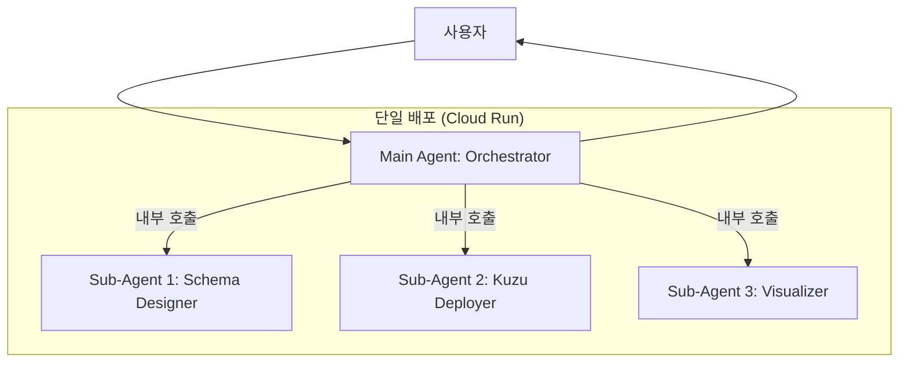

# 00. 프로젝트 개요 및 아키텍처 (Overview & Architecture)

## 📋 프로젝트 개요

**원본 프로그램**: AI Graph Designer (Vibe Prototyping 기반)
- **목적**: 비즈니스 요구사항을 입력받아 Kùzu Embedded Graph 스키마를 자동 생성하고 시각화
- **원본 기술 스택**: React + FastAPI + Gemini 3 Flash + React Flow
- **제안 방식**: Google ADK Agent + 로컬 Kùzu DB로 재구성 (클라우드 종속성 제거)

---

## 🔍 냉정한 분석 및 의견

### ✅ Agent 전환의 적합성

| 측면 | 분석 | 적합도 |
|------|------|--------|
| **입력 패턴** | 자연어/문서 기반 비즈니스 요구사항 입력 | ⭐⭐⭐⭐⭐ |
| **출력 형식** | 텍스트 설명 + 이미지(그래프 시각화) | ⭐⭐⭐⭐ |
| **상호작용** | 단방향 요청-응답 (반복 개선 가능) | ⭐⭐⭐⭐⭐ |
| **복잡도** | LLM 추론 + 이미지 생성으로 충분히 구현 가능 | ⭐⭐⭐⭐ |

### ⚠️ 주요 제약사항 및 해결 방안

1. **인터랙티브 그래프 편집 기능 상실**
   - **원본**: React Flow 기반 드래그 앤 드롭, 실시간 노드 편집
   - **Agent 버전**: 정적 이미지로 그래프 시각화
   - **해결책**: 대화형 수정 지원 및 반복적인 이미지 재생성으로 대응

2. **실시간 스트리밍 경험 제한**
   - **영향**: "빠른 프로토타이핑" 경험이 다소 저하될 수 있음
   - **해결책**: Gemini 2.0 Flash의 빠른 추론 속도 활용 및 진행 상황 메시지 보완

---

## 🎯 제안 아키텍처: Multi-Agent System

### 하이브리드 Main + Sub-Agents 구조



### 아키텍처 특징

1. **로컬 실행 및 단일 배포**: 로컬 Kùzu DB와 함께 즉시 실행 가능하며, 배포 시 단일 컨테이너로 패키징.
2. **내부 호출 성능**: Main → Sub-Agent 호출 시 네트워크 오버헤드 최소화.
3. **클라우드 비용 제로**: 로컬 스토리지 기반으로 PoC/테스트 대응.

### 폴더 구조 (Project Root 기준)

> [!IMPORTANT]
> 모든 에이전트 관련 파일은 반드시 프로젝트 루트 하위의 **`graph-designer-agent/`** 디렉토리 내에 생성되어야 합니다.

```
graph-designer-agent/
├── .env.example
├── pyproject.toml
├── kuzu_db/                  # 자동 생성됨
├── main_agent/               # Main Agent (Orchestrator)
├── schema_designer/          # Sub-Agent 1
├── kuzu_deployer/            # Sub-Agent 2
└── visualizer/               # Sub-Agent 3
```

