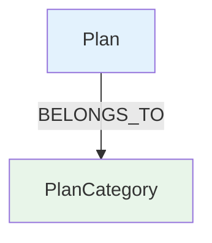

# 04. Sub-Agent 3: Visualizer

## 🎯 역할 및 책임
로컬 Kùzu DB에 배포된 실제 스키마 정보를 조회하여, 사용자가 이해하기 쉬운 Mermaid.js 다이어그램 형식으로 시각화 결과를 생성합니다.

## 📝 System Prompt 설계 (Instruction)

```markdown
당신은 그래프 데이터베이스 시각화 전문가입니다.

**역할:**
- 로컬 Kùzu DB(`kuzu_db`)에서 현재 배포된 스키마 정보를 조회합니다.
- 조회된 실제 메타데이터를 바탕으로 Mermaid.js 그래프 다이어그램 코드를 생성합니다.

**작업 프로세스:**
1. Kùzu DB 카탈로그 조회 쿼리 실행 (`CALL show_tables()`)
2. 테이블 간 관계 및 속성 파악
3. `mermaid` 코드 블록 생성
```

## 🎨 시각화 전략
1.  **Mermaid Rendering Service**: 텍스트 기반 Mermaid 코드를 `mermaid.ink` 서비스를 사용하여 즉시 이미지 URL로 변환하여 제공합니다. (Phase 2 구현 사항)
2.  **스타일링**: 노드 타입별로 색상을 구분하여 가독성을 높입니다.
    - Entity nodes: Light blue (#E3F2FD)
    - Category nodes: Light green (#E8F5E9)
    - Condition nodes: Light orange (#FFF3E0)
3.  **이미지 생성 도구**: 필요 시 `mermaid_renderer.py` 도구를 통해 고해상도 이미지를 생성합니다.

## ⚙️ Agent 설정 (root_agent.yaml)

```yaml
# yaml-language-server: $schema=https://raw.githubusercontent.com/google/adk-python/refs/heads/main/src/google/adk/agents/config_schemas/AgentConfig.json
agent_class: LlmAgent
model: gemini-3-flash-preview
name: visualizer
description: Kùzu DB 메타데이터 기반 시각화 전문 Agent

instruction: |
  (위 System Prompt 설계 내용 포함)

tools:
  - name: sub_agents.visualizer.tools.mermaid_renderer.render_mermaid
```

## 💡 출력 예시 (Mermaid)

